# 硬盘概念

## 硬盘结构
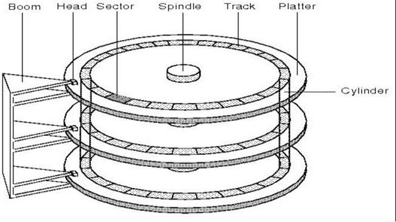


硬盘物理上主要是：机械手臂、磁头、主轴、盘片等组成。
在盘片逻辑划分上又分为磁道、扇区，例如下图：
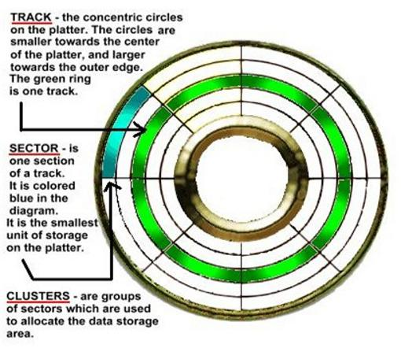

### 磁道
当硬盘盘片旋转时，磁头若保持在一个位置上，则磁头会在盘片表面划出一个圆形轨迹，这些圆形轨迹就叫做磁道。以盘片中心为圆心，由此可以划分出很多磁道来， 这些磁道用肉眼是根本看不到的，因为它们仅是盘面上以特殊方式磁化了的一些磁化区，硬盘上的信息便是沿着这样的轨道存放的，盘片上的磁道由外向内依次从“0”开始进行编号。

### 柱面：
	由于硬盘可以由很多盘片组成，不同盘片的相同磁道就组成了柱面(cylinder)，如图1所示。
### 磁头：
	假设有N个盘片组成的硬盘，那么有2N个盘面(一个盘片有2面)，那么磁头也就有2N个，即每个盘面有一个磁头。
### 扇区 ：
	早期的硬盘盘片的盘面以圆心开始向外放射状将磁道分割成等分的弧段，这些弧段便是硬盘的扇区(如图2)。每个扇区一般规定大小为512byte，
		问：这里大家应该比较疑惑，外圈周长很明显比内圈要长，怎么可能每个扇区都是512byte? 
		答：其实答案早期硬盘外圈存储比内圈存储密度低一些，所以外圈很长但是仍然只能存储512byte，
	因此如果我们知道了柱面数(磁道数) Cylinders、磁头数Heads、扇区数Sectors，基本上硬盘的容量我们能够计算出来 硬盘总容量= Cylinders * Heads * Sectors * 512byte。 
	
	但是由于早期硬盘外圈密度低，导致盘片利用率不高，现在的硬盘盘片则采用内外存储密度一致的方式，每个磁道都划分成以512byte大小的弧段，这样也造成了内外磁道上扇区数量会不一样，外圈上的扇区数要多于内圈扇区数。
### 硬盘寻址方式
	硬盘存取、读取数据，首先要做的就是寻址，即定位到数据所在的物理地址，在硬盘上就要找到对应的柱面、磁头以及对应的扇区，那么怎么寻址呢？   
	有两种方式：CHS和LBA
### CHS模式：
	CHS（Cylinder/Head/Sector）寻址模式也称为3D模式，是硬盘最早采用的寻址模式，它是在硬盘容量较小的前提下产生的。
	    硬盘的C/H/S 3D参数既可以计算出硬盘的容量，也可以确定数据所在的具体位置。这是因为扇区的三维物理地址与硬盘上的物理扇区一一对应，即三维物理地址可完全确定硬盘上的物理扇区。三维物理地址通常以C/H/S的次序来书写，如C/H/S为0/1/1，则第一个数字0指0柱面，第二个数字1指1磁头（盘面），第三个数字1指1扇区，表示该数据位于硬盘1盘面上的0磁道1扇区。现在定位已完成，硬盘内部的参数和主板BIOS之间进行协议，正确发出寻址信号，从而正确定位数据位置。
	早期硬盘一个磁道上分63个扇区，物理磁头最多16个（8个盘片，盘片多了硬盘那就真要加厚了）。采用8位寻址方式，8位二进制位的最大值是256（0-255），可以表示磁头数，而扇区只有63个（1-63），只需要其中6个二进制位即可表示，剩下2位拿去表示柱面，柱面数用10(8+2)位来表达，达到1024个柱面（0-1023），因此总扇区数（1024×16×63）。前面说一个扇区大小为512byte，这也就是说，如果以C/H/S寻址模式寻址，则IDE硬盘的最大容量只能为1024×16×63×512B= 500MB左右。

可以思考下，在8位寻址模式下，其实可以寻址的硬盘最大容量为1024×256×63×512B =8G,那为啥CHS模式硬盘只支持到500MB呢？原因很简单，我们的硬盘盘片不可能让128片盘片重叠起来吧，那会是多厚？？如果采用28位寻址方式，那么可以寻址137G，盘片也不可能一直堆叠下去。  
LBA(Logical Block Addressing)
   经常去买硬盘的人都知道，目前硬盘经常都说单碟、双碟，其实意思就是说硬盘盘片只有1个或者2个，而且都只是用一面，单碟一个磁头而已，但是硬盘容量确是几百G，而且硬盘柱面往往都大于1024个柱面，CHS是无法寻址利用完这些硬盘容量的。
    另外由于老硬盘的扇区划分方式对硬盘利用率不高，因此出现了现在的等密度盘，外圈的扇区数要比内圈多，原来的3D寻址方式也就不能适应这种方式，因此也就出现了新的寻址方式LBA，这是以扇区为单位进行的线性寻址方式，即从最外圈柱面0开始，依次将扇区号编为0、1….等等，举个例子，假设硬盘有1024个柱面，由于是等密度硬盘，柱面0(最外圈)假设有128个扇区，依次编号为0-127，柱面1有120个扇区，则依次编号为127-246，…..依次最内圈柱面127只有扇区64个，则编号到最后。因此要定位到硬盘某个位置，只需要给出LBA数即可，这个就是逻辑数。
        在 LBA 模式下，为了保留原来CHS时的概念，也可以设置柱面、磁头、扇区等参数，但是他们并不是实际硬盘的物理参数，只是为了计算方便而出的一个概念，1023之前的柱面号都一一物理对应，而1023以后的所有柱面号都记录成1023磁头最大数可以设置为255，而扇区数一般是每磁道63个，硬盘控制器会把由柱面、磁头、扇区等参数确定的地址转换为LBA数。这里我们再此明确两个概念：
###  物理扇区号：
	一般我们称CHS模式下的扇区号为物理扇区号，扇区编号开始位置是1
### 逻辑扇区号：
	LBA下的编号，扇区编号是从0开始。
	CHS模式转换到逻辑扇区号LBA
计算公式
	LBA(逻辑扇区号)=磁头数 × 每磁道扇区数 × 当前所在柱面号 + 每磁道扇区数× 当前所在磁头号 + 当前所在扇区号 – 1
	例如：CHS=0/0/1，则根据公式LBA=255 × 63 × 0 + 63 × 0 + 1 – 1= 0
	也就是说物理0柱面0磁头1扇区，是逻辑0扇区。
### 硬盘分区
	我们知道，一般使用硬盘，我们首先会对硬盘进行分区，然后对分区使用某个文件系统格式(NTFS、FAT、ext2/ext3)进行分区格式化，然后才能正常使用。那么分区是怎么回事呢？我们常见的windows中说到的c、d、e盘是怎么划分出来的呢？其实，在装windows系统过程中，一般我们只需要填写每个分区的大小，看不出来分区过程的实际工作情况，我们可以从linux系统分区过程反而能反应底层实际分区情况。
	柱面是分区的最小单位，即分区是以某个某个柱面号开始到某个柱面号结束的。

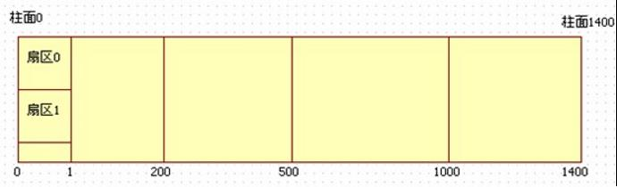


	如图，柱面1~200我们可以分为一个区，柱面201~500再划分为一个区，501~1000再划分为一个区，以此类推。大家可以看到，柱面0没有在任何分区里面，为何？这里说说，前面说到硬盘从外圈(柱面0)到内圈扇区是依次编号，看似各个扇区没有什么区别，但是这里硬盘的柱面0的第一个扇区(逻辑扇区0，CHS表示应该是0/0/1)却是最重要的，因为硬盘的第一个扇区记录了整个硬盘的重要信息，第一个扇区(512个字节)主要记录了两部分：
	①    MBR(Master Boot Record)：主引导程序就放在这里，主引导程序是引导操作系统的一个程序，但是这部分只占446字节。
	②    DPT(Disk Partition table)：硬盘分区表也在这里，分区表就是用来记录硬盘的分区情况的，例如c盘是1~200柱面，d盘是201~500柱面，分区表总共只占64字节，可以看出，分区其实很简单，就是在这个表里面修改一下记录就重新分区了，但是由于只有64字节，而一条记录就要占用16字节，这个分区表最多只能记录4个分区信息，为了继续分出更多分区来，引入了扩展分区的概念，也就是说，在这4个分区中，可以使用其中一条记录来记录扩展分区的信息，然后在扩展分区中再继续划分逻辑分区，而逻辑分区的分区记录则记录在扩展分区的第一个扇区中，如此则可以像链表一样划分出很多分区来。但是请注意，一个分区表中可以有1~4条主分区，但是最多只能有1个扩展分区。
	举例，主分区可以是P1:1~200，扩展分区P2: 2~1400，扩展分区开始的第一个扇区可以用来记录扩展分区中划分出来的逻辑分区。

## 分区表链
  分区表之间是如何关联的，详细讲一下，分区表是一个单向链表，第一个分区表，也就是位于硬盘第一个扇区中的DPT，可以有一项记录扩展分区的起始位置柱面，类似于指针的概念，指向扩展分区(图3)，根据这项记录我们可以找到扩展分区的某柱面0磁头1扇区(CHS)，而这个扇区中又存放了第二个分区表，第二个分区表第一项记录一般表述了当前所在的逻辑分区的起始/终止柱面，第二项记录表述了下一个逻辑分区所在的0磁头1扇区(CHS),第三、第四项记录不存任何信息(图4)。
  请看下图，主引导记录/分区表所在的是硬盘第一个分区，基本分区1、基本分2、基本分区3都是主分区、扩展分区内有2个逻辑分区，每个逻辑分区的第一个扇区都是分区表，至于引导扇区(DBR)，在系统启动一节中会提及。
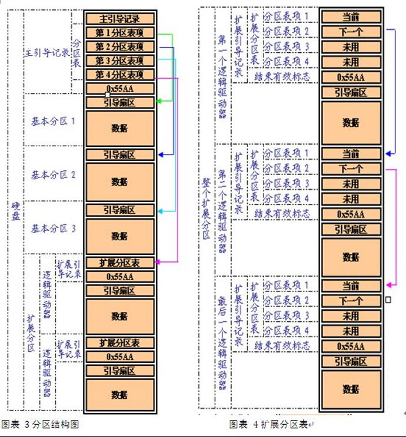

系统启动：
 之前提到MBR中安装的引导加载程序，他的作用是什么？
①    提供开机菜单选项：可以供用户选择启动哪个操作系统，这是多重引导功能。
②    加载操作系统内核：每个操作系统都有自己的内核，需要引导程序来加载
③    转交给其他引导程序：可以将工作移交给其他引导程序来进行上述操作。
  其实引导加载程序除了可以安装在MBR中，还可以直接安装在每个分区的引导扇区(DBR)中，注意下，每个分区(主分区、逻辑分区)都有一个自己的启动扇区，专门用来安装引导加载程序，如上图标3结构图。

### 系统启动过程：
1. 首先,BIOS启动后，读取硬盘第一个扇区MBR中的引导加载程序(可能是windows或者linux的grub)
2. MBR中的引导程序提供开机菜单，你可以选择
  1)直接加载windows 内核 
  2)将工作转交给windows 分区内的引导扇区中的加载程序ntldr，让他自己去加载内核 
  3)转交给linux分区内引导扇区，让他去加载linux.
3. 根据用户选择的选项和引导加载程序中记录的分区，到分区表找对应的分区柱面号等分区信息，启动内核或者分区加载程序。

  Window安装时默认会自动将MBR和windows所在分区的引导扇区都装上引导程序，而不会提供任何选项给用户选择，因此如果之前装过其他操作系统，然后再另外装一个windows时，会把公用的MBR覆盖掉，如此，原来的操作系统就无法启动了。如果先装windows，然后装linux，linux 会覆盖MBR，然后让用户选择是否将windows等其他操作系统的启动项添加进来，如果你选择了添加进来，那么你在开机时就会有两个选项让用户进行选择了。
## 后记
1. 这里讨论的全部是硬盘相关的东西，光盘不在此列，而且光盘的磁道并不是从外圈到内圈编号，而是从内圈开始编号，这点注意。
2. 硬盘第一个扇区是由MBR和分区表占据，因此0柱面0磁头上剩下的62个扇区一般会空出来保留（这部分保留称为隐藏扇区，因为操作系统读取不到这部分扇区，这部分扇区是提供给BIOS读取的），而系统分区则从0柱面1磁头1扇区开始，折算成
  `LBA=255 × 63 × 0 + 63 × 1 + 1 – 1= 63`
  即从LBA 63号扇区开始分区。不过查阅有的资料提及到另外一种说法，那就是有的硬盘可能0柱面全部空下来，如果真是这样，那浪费可就真的大了。
3. 对于扩展分区的分区表我们知道也是由扩展分区的第一个扇区开始写，而且是写到每个逻辑驱动器的第一个扇区，同样，扩展分区内的第一个扇区所在的磁道剩余的扇区也会全部空余出来，这些保留的扇区操作系统也是无法读取的，注意在扩展分区的第一个扇区里面是没有引导加载记录的。引导加载记录都是放在隐藏扇区后面的。可以看图3，图4

## MBR结构

MBR Master Boot Record，又叫做主引导扇区，是[计算机](https://zh.wikipedia.org/wiki/%E8%AE%A1%E7%AE%97%E6%9C%BA)开机后访问[硬盘](https://zh.wikipedia.org/wiki/%E7%A1%AC%E7%9B%98)时所必须要读取的首个扇区，它在硬盘上的三维地址为（柱面，磁头，扇区）＝（0，0，1）。在深入讨论主引导扇区内部结构的时候，有时也将其开头的446字节内容特指为“主引导记录”（MBR），其后是4个16字节的“磁盘分区表”（DPT），以及2字节的结束标志（55AA）。因此，在使用“主引导记录”（MBR）这个术语的时候，需要根据具体情况判断其到底是指整个主引导扇区，还是主引导扇区的前446字节。

`MBR= bootloader(446B) +DPT(64B) + 结束标志55AA(2B)`

主引导扇区记录着硬盘本身的相关信息以及硬盘各个分区的大小及位置信息，是数据信息的重要入口。如果它受到破坏，硬盘上的基本数据结构信息将会丢失，需要用繁琐的方式试探性的重建数据结构信息后才可能重新访问原先的数据。主引导扇区内的信息可以通过任何一种基于某种操作系统的分区工具软件写入，但和某种操作系统没有特定的关系，即只要创建了有效的主引导记录就可以引导任意一种操作系统（操作系统是创建在[高级格式化](https://zh.wikipedia.org/wiki/%E9%AB%98%E7%BA%A7%E6%A0%BC%E5%BC%8F%E5%8C%96)的硬盘分区之上，是和一定的文件系统相联系的）

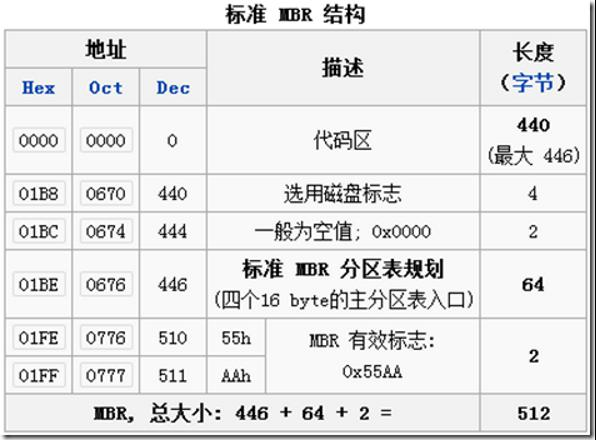

对于硬盘而言，一个扇区可能的字节数为128×2n（n=0,1,2,3）。

大多情况下，取n=2，即一个扇区（sector）的大小为512字节。

 

启动代码 bootloader

主引导记录最开头是第一阶段引导代码。其中的硬盘引导程序的主要作用是检查分区表是否正确并且在系统硬件完成自检以后将控制权交给硬盘上的引导程序（如GNUGRUB）。 它不依赖任何操作系统，而且启动代码也是可以改变的，从而能够实现多系统引导。

硬盘分区表

硬盘分区表占据主引导扇区的64个字节(偏移01BEH–偏移01FDH)，可以对四个分区的信息进行描述，其中每个分区的信息占据16个字节。具体每个字节的定义可以参见硬盘分区结构信息。

```
MBR分区是将分区信息保存到磁盘的第一个扇区(MBR扇区512B)中的64个字节(DPT)中，
每个分区项占用16个字节，这16个字节中存有：
分区活动状态标志{1B}
分区起始磁头号HEAD{1B}
分区起始扇区号SECTOR(02H[0,5]),分区起始磁柱号CYLINDER(02H[6,7],03H[0,8]){2B}
文件系统标志位{1B}
分区结束磁头号HEAD{1B}
分区结束扇区号SECTOR(06H[0,5]),分区结束磁柱号CYLINDER(06H[6,7],07H[0,8]){2B}
分区起始相对扇区号{4B}
分区总扇区数{4B} ********
```


这种分区案用4个字节存储分区的总扇区数，最大能表示2的32次方的扇区个数，按每扇区512字节计算，每个分区最大不能超过2TB。

基于以上原因：
MBR支持的文件系统(分区)大小计算公式：
`(分区4B(2^32)  * 扇区大小512B) /1024K/1024M/1024G = 2048G = 2T`

 

从主引导记录的结构可以知道，它仅仅包含一个64个字节的硬盘分区表。由于每个分区信息需要16个字节，所以对于采用MBR型分区结构的硬盘，最多只能识别4个主要分区（Primarypartition）。所以对于一个采用此种分区结构的硬盘来说，想要得到4个以上的主要分区是不可能的。这里就需要引出扩展分区了。

扩展分区也是主要分区的一种，但它与主分区的不同在于理论上可以划分为无数个逻辑分区。

扩展分区中逻辑驱动器的引导记录是链式的。每一个逻辑分区都有一个和MBR结构类似的扩展引导记录(EBR)，其分区表的第一项指向该逻辑分区本身的引导扇区，第二项指向下一个逻辑驱动器的EBR，分区表第三、第四项没有用到。

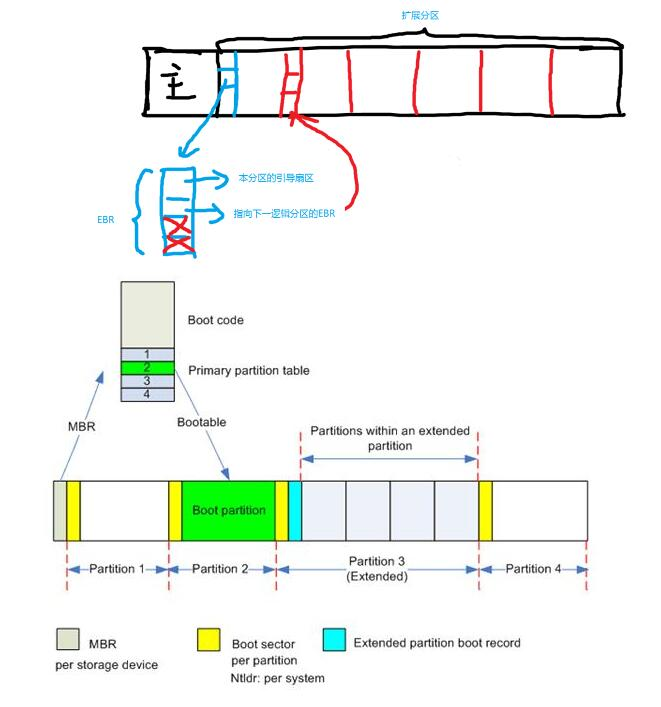


Windows系统默认情况下，一般都是只划分一个主分区给系统，剩余的部分全部划入扩展分区。这里有下面几点需要注意：

- 在MBR分区表中最多4个主分区或者3个主分区＋1个扩展分区，也就是说扩展分区只能有一个，然后可以再细分为多个逻辑分区。
- 在Linux系统中，硬盘分区命名为sda1－sda4或者hda1－hda4（其中a表示硬盘编号可能是a、b、c等等）。在MBR硬盘中，分区号1－4是主分区（或者扩展分区），逻辑分区号只能从5开始。
- 在MBR分区表中，一个分区最大的容量为2T，且每个分区的起始柱面必须在这个disk的前2T内。你有一个3T的硬盘，根据要求你至少要把它划分为2个分区，且最后一个分区的起始扇区要位于硬盘的前2T空间内。如果硬盘太大则必须改用GPT。

### 常见分区类型ID

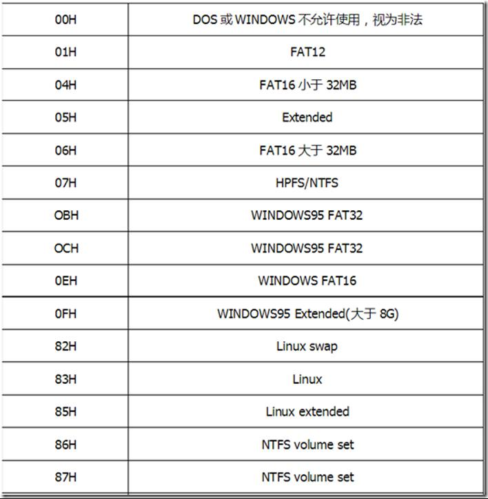


### mbr事例

`dd  if=/dev/sda of=/root/mbr.bak bs=512 count=1`

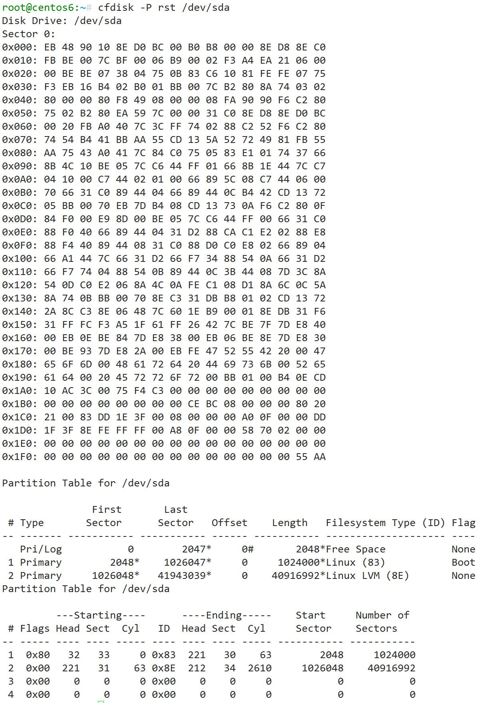


```
# DPT 01BE~01FD
	１. 分区状态标签(00非活动,80活动) 1B  
	２. HEAD  start head   1B   本例： 32
	３. SECTOR start sector  2B  本例： 33
	４. FT file system type  1B=2**8=256  83
	５. HEAD  end head 1B   本例： 221
	６. SECTOR end sector  本例： 1E3F
	７. 分区起始相对区号   本例： 2048
分区总的扇区数    本例： 10489600
```


## mbr与GPT

对很多PC的使用者来说，UEFI就像是一颗深水炸弹，表面风平浪静，暗地里却早已引发了巨大的震动。多亏了Microsoft的强横，预装WIN8的电脑指定需要GPT分区这一举措，让人们不禁发出感慨：哦天哪，我的电脑里还有这东西？一些好学的人对GPT进行了解以后，进一步发现了我们的幕后功臣：UEFI。本期文章我们就来说说，硬盘和硬盘分区这点事。

简单地说，硬盘分区是就使用分区编辑器（partitioneditor）将一个硬盘上划分几个独立的逻辑部分，盘片一旦划分成数个分区，不同类的目录与文件可以存储进不同的分区。越多分区，也就有更多不同的地方，可以将文件的性质区分得更细，按照更为细分的性质，存储在不同的地方以管理文件；但太多分区就成了麻烦。

硬盘分区就像给一间空荡的房子划分出卧室，厨房，客厅等相互隔离的空间一样。主要是为了方面用户的使用。另一方面，通过合理的硬盘分区，有效保护系统盘空间，确实能够提高系统运行速度，再者，硬盘分区也可以有效地对数据进行保护。你当然可以不分区，只不过，当你面对越来越多的子目录，或者是越来越慢的Windows，不得不费功夫去管理你的文件，或者重装Windows的时候，恐怕会悔不当初。“不要把所有的鸡蛋放在同一个篮子里”这句至理名言在经济学以外的其他领域也同样是句警世恒言。

在讲解MBR之前，有必要讲讲机械硬盘的一些相关概念，毕竟MBR作为20世纪最棒的磁盘管理方式，与机械硬盘可是联系紧密的

（这样可以更好地理解后面的内容）。

机械硬盘原理

机械硬盘由坚硬金属材料制成的涂以磁性介质的盘片，盘片两面称为盘面或扇面，都可以记录信息，由磁头对盘面进行操作（如果你有坏的硬盘，可以动手拆开看。嗯？为什么用坏的？用好的可能费钱……）一般用磁头号区分。结构特性决定了机械硬盘如果受到剧烈冲击（摔在地上或是勤奋的你想拆开学习），磁头与盘面可能产生的哪怕是轻微撞击都有可能报废。

继续讲原理：假设磁头不动，硬盘旋转，那么磁头就会在磁盘表面画出一个圆形轨迹并将之磁化，数据就保存在这些磁化区中，称之为磁道，将每个磁道分段，一个弧段就是一个扇区。一个硬盘可以包含多个扇面，扇面同轴重叠放置，每个盘面磁道数相同，具有相同周长的磁道所形成的圆柱称之为柱面，柱面数与磁道数相等。如下图

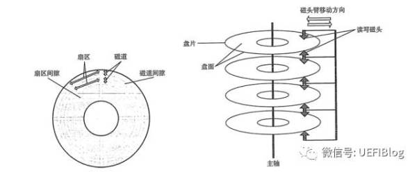


了解了这些，我们就可以对最初的硬盘地址管理方式作一个原理层面的了解：

最初的寻址方式称为CHS，在LBA（LogicalBlockAddress）概念诞生之前，由他负责管理磁盘地址。所谓CHS即柱面（cylinder），磁头（header），扇区（sector），通过这三个变量描述磁盘地址，需要明白的是，这里表示的已不是物理地址而是逻辑地址了。这种方法也称作是LARGE寻址方式。该方法下：

硬盘容量=磁头数×柱面数×扇区数×扇区大小（一般为512byte）。

后来，人们通过为每个扇区分配逻辑地址，以扇区为单位进行寻址，也就有了LBA寻址方式。但是为了保持与CHS模式的兼容，通过逻辑变换算法，可以转换为磁头/柱面/扇区三种参数来表示，和LARGE寻址模式一样，这里的地址也是逻辑地址了。（固态硬盘的存储原理虽然与机械硬盘不同，采用的是flash存储，但仍然使用LBA进行管理，此处不再详述。）

科普到这里，我们可以试图去理解MBR分区了。现在我们来看看MBR分区的技术原理。

MBR原理

MBR：Master BootRecord，主分区引导记录。最早在1983年在IBM PC DOS2.0中提出。前面说过，每个扇区/区块都被分配了一个逻辑块地址，即LBA，而引导扇区则是每个分区的第一扇区，而主引导扇区则是整个硬盘的第一扇区（主分区的第一个扇区）。MBR就保存在主引导扇区中。另外，这个扇区里还包含了硬盘分区表DPT（DiskPartition Table），和结束标志字（Magic number）。扇区总计512字节，MBR占446字节（0000H -01BDH），DPT占据64个字节（01BEH - 01FDH），最后的magic number占2字节（01FEH – 01FFH）。


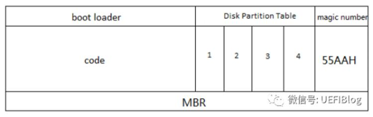

现在，我们来看一个MBR记录的实例：

8001 01 00, 0B FE BF FC, 3F 00 00 00, 7E 86 BB 00

其中，“80”是一个分区的激活标志，表示系统可引导；“01 0100”表示分区开始的磁头号为01，开始的扇区号为01，开始的柱面号为00；“0B”表示该分区的系统类型是FAT32，其他比较常用的有04(FAT16)、07(NTFS)；“FEBF FC”表示分区结束的磁头号为254，分区结束的扇区号为63、分区结束的柱面号为764；“3F 00 00 00”表示首扇区的相对扇区号为63；“7E86 BB 00”表示总扇区数为12289622。

可以看到，在只分配64字节给DPT的情况下，每个分区项分别占用16个字节，因此只能记录四个分区信息，尽管后来为了支持更多的分区，引入了扩展分区及逻辑分区的概念。但每个分区项仍然用16个字节存储。能表示的最大扇区数为FFFF,FF FFH，因此可管理的最大空间=总扇区数*扇区大小（512byte），也就是2TB（由于硬盘制造商采用1:1000进行单位换算，因此也有2.2TB一说，别怪他们，他们不是程序员）。超过2TB以后的空间，不能分配地址，自然也就无法管理了。

MBR的诸多缺点使其应用大大受限。硬盘技术日新月异，硬盘容量突飞猛进（希捷将于今年开卖60TB固态硬盘），多出来的硬盘空间总不能晾着吧，于是，在刚诞生的UEFI规范下一起研发了新技术

GPT原理

GPT分区：全称为 Globally UniqueIdentifier Partition Table，也叫做GUID分区表，它是UEFI规范的一部分。由于硬盘容量的急速增长，MBR的2.2T容量难以满足要求，而UEFI BIOS的推广也为GPT的实现打下了坚实的技术基础，GPT应运而生，

我们来看看GPT的结构图：


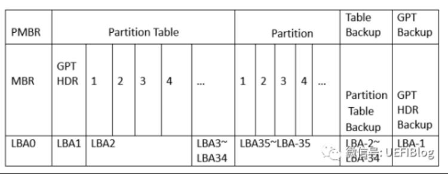

等等，MBR是不是走错片场了？答案当然是没有。这里的P意为protective，PMBR存在的意义就是，当不支持GPT的分区工具试图对硬盘进行操作时（例如MS-DOS和Linux的fdisk程序），它可以根据这份PMBR以传统方式启动，过程和MBR+BIOS完全一致，极大地提高了兼容性。而支持GPT的系统在检测PMBR后会直接跳到GPT表头读取分区表。和MBR类似，分区表中存储了某个分区的起始和结束位置及其文件系统属性信息，而分区才是实际存在的物理磁盘的一部分。

GPTHDR：GPT表头，如下图，主要定义了分区表中项目数及每项大小，还包含硬盘的容量信息。在64位的Windows Server2003的机器上，最多可以创建128个分区，即分区表中保留了128个项，其中每个都是128字节。（也是EFI标准中的最低要求：分区表最小要有16,384字节）分区表头还记录了这块硬盘的GUID，分区表头位置（总是LBA1）和大小，也包含了备份分区表头和分区表的位置和大小信息（LBA-1~LBA-34）。同时还储存着它本身和分区表的CRC32校验。固件、引导程序和操作系统在启动时可以根据这个校验值来判断分区表是否出错，如果出错，可以使用软件从硬盘最后的备份GPT中恢复整个分区表，如果备份GPT也校验错误，硬盘将不可使用。具体内容如下表：

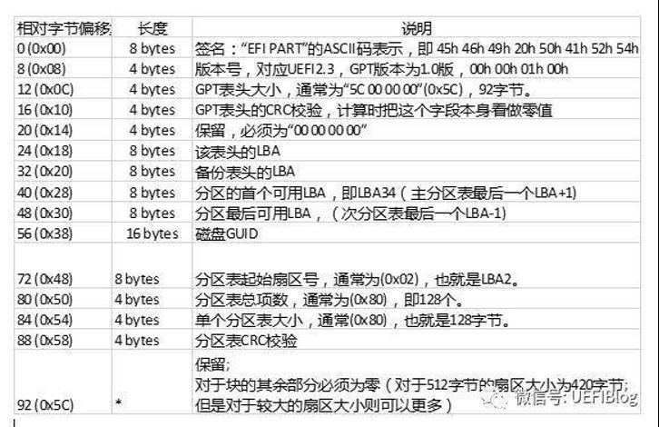

Partition
Table：分区表，包含分区的类型GUID（如：EFI系统分区的GUID类型是{C12A7328-F81F-11D2-BA4B-00A0C93EC93B}），名称，起始终止位置，该分区的GUID以及分区属性。其内容如下：


Microsoft对分区属性做了更详细的区分，目前有：


相较于MBR，GPT具有以下优点：

（1）得益于LBA提升至64位，以及分区表中每项128位设定，GPT可管理的空间近乎无限大，假设一个扇区大小仍为512字节，可表示扇区数为，算下来，可管理的硬盘容量=18EB(1EB=1024PB=1,048,576TB)，2T在它面前完全不在话下。按目前的硬盘技术来看，确实近乎无限，不过，以后的事谁知道呢。

（2）分区数量几乎没有限制，由于可在表头中设置分区数量的大小，如果愿意，设置个分区也可以（有人愿意管理这么多分区吗），不过，目前windows仅支持最大128个分区。

（3）自带保险，由于在磁盘的首尾部分各带一个GPT表头，任何一个受到破坏后都可以通过另一份恢复，极大地提高了磁盘的抗性（两个一起坏的请出门买彩票）。

（4）循环冗余检验值针对关键数据结构而计算，提高了数据崩溃的检测几率。

（5）尽管目前分区类型不超过百数（十数也没有吧。），GPT仍提供了16字节的GUID来标识分区类型，使其更不容易产生冲突。

（6）每个分区都可以拥有一个特别的名字，最长72字节，足够写一首七律了。满足你的各种奇葩起名需求。

完美支持UEFI，毕竟它就是UEFI规范的衍生品。在将来全行业UEFI的情境下，GPT必将更快淘汰MBR。

其他

接下来进入加料时间，更详细的讲述硬盘知识。

前面说到过，磁化的弧段称作一个扇区，一个扇区大小512B，但硬盘在进行文件操作时并非以扇区为单位，而是——簇，“簇”是系统进行分配的最小单位，一个簇可以包含多个扇区，假设目前一个簇包含4个扇区，簇大小为2KB，一个文件大小恰为2KB，则占用了簇的所有可用空间，即便你有一个1B大小的文件需要保存，那么你占用的空间也是一个簇，簇内其他空间不可读写。

而对簇的大小进行管理的就是文件系统：

FAT16/FAT32:早期的MS-DOS和WIN95操作系统中最常见的硬盘分区格式。一个簇最小为512个字节，其大小可以成倍增长，最大为32K，系统为每个簇分配唯一的索引号——一个16位二进制数来标识。因为16位二进制数最大为65536，所以FAT分区所拥有的簇的数量不可能超过65536个。这正是FAT分区大小不能超过2GB的原因。FAT16的继任者——FAT32与其原理基本相同，相比前任优势仅在于分区可以大于2GB，但不能存储大于4GB的单个文件，看看现在一部BD的电影都要3,4个G，显然不能满足时代的需求，被淘汰的很快。

更多FAT文件系统知识：[FAT文件系统与UEFI- 知乎专栏](https://zhuanlan.zhihu.com/p/25992179)

NTFS文件系统相比FAT，最大优点在于支持文件加密，通过采用日志式文件系统，详细记录磁盘的所有读写操作，提高了数据和系统的安全性，另一点则是突破了4GB大小限制。也是目前机械硬盘上的分区主流。不过对于目前越来越亲民的的flash存储，过多的操作记录对存储介质造成了较大的负担，同样的存取操作，NTFS下的读写次数就会比FAT32下来得多，造成了寿命较短的缺陷。因此针对移动存储设备和固态硬盘，推出了exFAT文件系统。

exFAT：分区大小和单文件大小最大可达16EB（16×1024×1024TB）；簇大小非常灵活，最小512B，最高达32MB；采用了剩余空间分配表，空间利用率更高；同一目录下最大文件数可达65536个。其特性未必强于NTFS，主要是针对flash存储设备进行了优化（SSD，U盘），传统硬盘不能格式化为该格式。


要是到现在你对扇区，簇，文件系统，分区几个名词有点混淆，不妨看看下图：

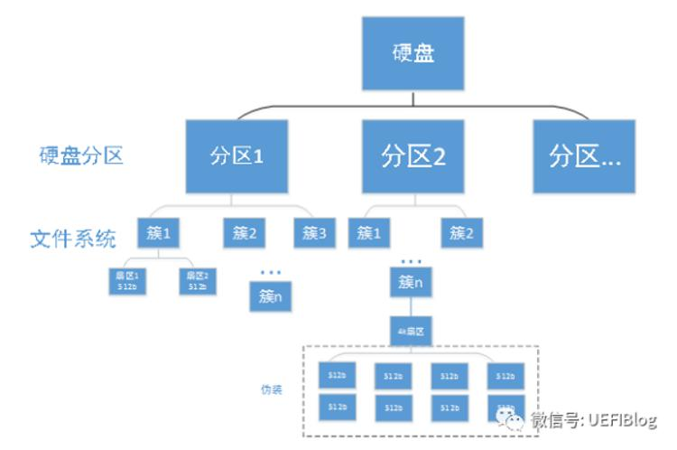

有人会问，图中的怎么突然出现了4k扇区，而且为什么下面又包含的是8个512b的扇区呢？边上的伪装是啥意思？恭喜你，你已经抓住了近年来的硬盘发展潮流。

扇区的大小虽然约定俗成，但其实是可以更改的，开始于2009 年晚期，硬盘制造商正在从传统的 512 字节扇区迁移到更大、更高效的 4096 字节扇区，国际硬盘设备与材料协会（InternationalDisk Drive Equipment and

MaterialsAssociation，IDEMA）将之称为高级格式化，也就是现在常说的“4K扇区”。

多年来，硬盘行业一直采用512字节扇区。然而，随着硬盘容量的不断增长，扇区大小日渐成为提高硬盘容量和纠错效率方面的制约。扇区分辨率（扇区大小和总存储大小的百分比）越来越低，尽管在管理小型离散数据时，分辨率越低越好。但现代的计算系统中多的是大型数据块，一般远比传统512 字节扇区大小要大得多。另外，随着区域密度的增加，小型 512字节扇区在硬盘表面上占用的空间也将越来越小。硬盘扇区中的数据占据的空间越小，错误纠正就会变得越困难，因为同样大小的介质缺陷对总体数据负载损害的百分比更高，所以就需要更大的纠错强度。现在，硬盘开始通过先进的区域密度来提高错误纠正的上限。因此，为了改善错误纠正和实现格式化效率，提高扇区大小是硬盘行业内的普遍诉求。

不过，由于计算机系统的缓慢发展，多数仍将扇区假定为512字节，因此就产生了4K对齐问题。即使物理硬盘分区与计算机使用的逻辑分区对齐，保证硬盘读写效率。

有4k对齐当然就有4k对不齐。这个锅，或许应该甩给操作系统。硬盘厂商为了保证与操作系统的兼容性，将新标准的"4K扇区"的硬盘模拟成扇区为512B的硬盘，问题出现在此时：当在一些特殊情况下格式化的系统（比如用ghost11.5以下版本），会默认定义为4096字节大小为一个簇，这没毛病，但是，由于其引导区只占用了不多不少63个扇区，真正的文件系统在63号扇区之后，

我们可以算出前63个扇区大小为：63*512B= 32256B。

63个扇区占用簇个数：32256B/4096B=7.875簇。

从第64个扇区开始，每个簇都会跨越两个物理单元，占据前一个单元的一小部分和后一个单元的一大部分，前面说过，系统文件操作以簇为单位，如果每个簇都要用到两个扇区，势必拖累读写速度。也就产生了“4k对不齐”的概念，“4K对齐”要做的事就是将硬盘的模拟扇区(512B)对齐到的8整数倍个“实际”4K扇区，即8*4096= 32768B，使其正好跨过63扇区的特性，从第64个扇区对齐。

其实不仅是操作系统，一些广泛使用的软件程序也可能引发4k对不齐现象。因此，对齐技术的存在确有其必要性。尽管4k必然取代512b，但冰冻三尺非一日之寒，全行业仍需要一个时间来进行技术的全面推广。