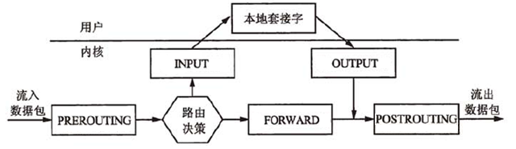

# iptables 

## netfilter
netfilter Linux2.4之后引入的包过滤引擎。工作于内核空间，主要实现以下四大功能：

|功能|表|引用模块|备注|
|----|----|------|----|
|包过滤 |filter(dfeult)|iptable_filter|
|NAT| nat|iptable_nat|
|包修改| mangle| iptable_mangle|修改包元数据，做防火墙标记
|快速通道|raw| iptable_raw|符合raw表规则的包会跳过一些检查

基于内核空间放置了5个链的hook函数，如下图：



## iptables
iptables 基于用户空间的netfilter的管理工具；按照用途和使用场合，将5条链各自切分到五张不同的表中来管理netfilter。也就是说每张表中可以按需要单独为某些链配置规则。

例如，mangle表和filter表中都能为INPUT链配置规则，当数据包流经INPUT位置（进入用户空间），这两个表中INPUT链的规则都会用来做过滤检查。

### iptables服务管理
```
service iptables start|stop|restart|status
//定义的所有内容，在重启时都会失效。调用save命令可以把规则保存到文件/etc/sysconfig/iptables中。
service iptables save
iptables-save           //保存规则
iptables-restore        //加载规则。开机的时候，会自动加载/etc/sysconfig/iptables
iptables-restore < /etc/sysconfig/iptables2     //加载自定义的规则文件
 
//iptables服务配置文件：   /etc/sysconfig/iptables-config
//iptables规则文件：       /etc/sysconfig/iptables
 
echo "1">/proc/sys/net/ipv4/ip_forward   //打开iptables转发：
```


### iptables规则机制
`iptables规则 = 检查条件 + 处理机制`

```
检查条件：
IP协议：SIP,DIP 
TCP协议： sport,dport,flags
UDP协议：sport,dport
ICMP协议：icmp-type
```

```
处理机制：
DROP
REJECT
ACCEPT
SNAT
DNAT
RETURN
REDIRECT
LOG
自定义链
```


### ipables 命令参考
`iptables [-t tables] command [CHAIN] [cretiria]... [-j ACTION]`

#### command 命令选项
```
-A|--append  CHAIN                                 //链尾添加新规则
-D|--delete  CHAIN [RULENUM]                       //删除链中规则，按需序号或内容确定要删除的规则
-I|--insert  CHAIN [RULENUM]                       //在链中插入一条新的规则，默认插在开头
-R|--replace CHAIN  RULENUM                        //替换、修改一条规则，按序号或内容确定
-L|--list   [CHAIN [RULENUM]]                      //列出指定链或所有链中指定规则或所有规则
-S|--list-urles [CHAIN [RULENUM]]                  //显示链中规则
-F|--flush [CHAIN]                                 //清空指定链或所有链中规则
-Z|--zero [CHAIN [RULENUM]]                        //重置指定链或所有链的计数器(匹配的数据包数和流量字节数)
-N|--new-chain CHAIN                               //新建自定义规则链
-X|--delete-cahin [CHAIN]                          //删除指定表中用户自定义的规则链
-E|--rename-chain OLDCHAIN NEWCHAIN                //重命名链，移动任何引用
-P|-policy CHAIN TARGET                            //设置链的默认策略，数据包未匹配任意一条规则就按此策略处理
```

#### cretiria 条件匹配
- 基本匹配
- 扩展匹配
    - 隐式匹配
    - 显示匹配

##### 基本匹配
```
-p|--proto  PROTO                      //按协议匹配，如tcp、udp、icmp，all表示所有协议。 （/etc/protocols中的协议名）
-s|--source ADDRESS[/mask]...          //按数据包的源地址匹配，可使用IP地址、网络地址、主机名、域名
-d|--destination ADDRESS[/mask]...     //按目标地址匹配，可使用IP地址、网络地址、主机名、域名
-i|--in-interface INPUTNAME[ +]        //按入站接口(网卡)名匹配，+用于通配。如 eth0, eth+ 。一般用在INPUT和PREROUTING链
-o|--out-interface OUTPUTNAME[+]       //按出站接口(网卡)名匹配，+用于通配。如 eth0, eth+ 。一般用在OUTPUT和POSTROUTING链
```

##### 扩展匹配
```
-m|--match MATCHTYPE  EXTENSIONMATCH...    //扩展匹配，可能加载extension
```

##### 隐匿扩展匹配
对-p PROTO的扩展，或者说是-p PROTO的附加匹配条件，-m PROTO 可以省略，所以叫隐式
```
-m tcp   //-p tcp的扩展
　　　　--sport  [!]N[:M]   //源端口, 服务名、端口、端口范围。
　　　　--dport  [!]N[:M]   //目标端口，服务名、端口、端口范围
　　　　--tcp-flags CHECKFLAGS FLAGSOFTRUE  //TCP标志位:SYN(同步),ACK(应答),RST(重置),FIN(结束),URG(紧急),PSH(强迫推送)。多个标志位逗号分隔。
//CHECKFLAGS为要检查的标志位，FLAGSOFTRUE为必须为1的标志位（其余的应该为0）
　　　　--syn       //第一次握手。 等效于 --tcpflags syn,ack,fin,rst syn   四个标志中只有syn为1
-m udp   //-p udp的扩展
　　　　--sport N[-M] 
　　　　--dport N[-M]
-m icmp  //隐含条件为-p icmp
　　　　--icmp-type  N       //8:echo-request  0:echo-reply
```


##### 显示扩展匹配
```
-m state
　　　　--state    //连接状态检测，NEW,ESTABLISHED,RELATED,INVALID
-m multiport 
　　　　--source-ports   PORT[,PORT]...|N:M            //多个源端口，多个端口用逗号分隔，
　　　　--destination-ports PORT[,PORT]...|N:M         //多个目的端口
　　　　--ports     　　//多个端口，每个包的源端口和目的端口相同才会匹配
-m limit
　　　　--limit   N/UNIT    //速率，如3/minute, 1/s, n/second , n/day
　　　　--limit-burst N     //峰值速率，如100，表示最大不能超过100个数据包
-m connlimit
　　　　--connlimit-above N  //多于n个，前面加!取反
-m iprange
　　　　--src-range IP-IP
　　　　--dst-range IP-IP
-m mac                    
　　　　--mac-source         //mac地址限制，不能用在OUTPUT和POSTROUTING规则链上，因为封包要送到网卡后，才能由网卡驱动程序透过ARP 通讯协议查出目的地的MAC 地址
-m string
　　　　--algo [bm|kmp]      //匹配算法
　　　　--string "PATTERN"   //匹配字符模式
-m recent
　　　　--name               //设定列表名称，默认为DEFAULT
　　　　--rsource            //源地址
　　　　--rdest              //目的地址
　　　　--set                //添加源地址的包到列表中
　　　　--update             //每次建立连接都更新列表
　　　　--rcheck             //检查地址是否在列表
　　　　--seconds      //指定时间。必须与--rcheck或--update配合使用
　　　　--hitcount     //命中次数。必须和--rcheck或--update配合使用
　　　　--remove             //在列表中删除地址
-m time
　　　　--timestart h:mm
　　　　--timestop  hh:mm
　　　　--days DAYS          //Mon,Tue,Wed,Thu,Fri,Sat,Sun; 逗号分隔
-m mark
　　　　--mark N            //是否包含标记号N
-m owner 
　　　　--uid-owner 500   //用来匹配来自本机的封包，是否为某特定使用者所产生的,可以避免服务器使用root或其它身分将敏感数据传送出
　　　　--gid-owner O     //用来匹配来自本机的封包，是否为某特定使用者群组所产生的
　　　　--pid-owner 78    //用来匹配来自本机的封包，是否为某特定进程所产生的
　　　　--sid-owner 100   //用来匹配来自本机的封包，是否为某特定连接（Session ID）的响应封包
```

##### action 目标策略(target)
```
-j|--jump TARGET                //跳转到目标规则，可能加载target extension
-g|--goto  CHAIN                //跳转到指定链，不再返回
ACCEPT             规则验证通过，不再检查当前链的后续规则，直接跳到下一个规则链。
DROP                直接丢弃数据包，不给任何回应。中断过滤。
REJECT             拒绝数据包通过，会返回响应信息。中断过滤。
--reject-with  tcp-reset|port-unreachable|echo-reply
LOG                  在/var/log/messages文件中记录日志，然后将数据包传递给下一条规则。详细位置可查看/etc/syslog.conf配置文件
--log-prefix "INPUT packets"
ULOG                更广范围的日志记录信息
QUEUE              防火墙将数据包移交到用户空间，通过一个内核模块把包交给本地用户程序。中断过滤。
RETURN            防火墙停止执行当前链中的后续规则，并返回到调用链。主要用在自定义链中。
custom_chain    转向自定义规则链
DNAT                目标地址转换，改变数据包的目标地址。外网访问内网资源，主要用在PREROUTING。完成后跳到下一个规则链
--to-destination ADDRESS[-ADDRESS][:PORT[-PORT]]
SNAT                源地址转换，改变数据包的源地址。内网访问外网资源。主机的IP地址必须是静态的，主要用在POSTROUTING。完成后跳到下一个规则链。
--to-source ADDRESS[-ADDRESS][:PORT[-PORT]]
MASQUERADE   源地址伪装，用于主机IP是ISP动态分配的情况，会从网卡读取主机IP。直接跳到下一个规则链。
--to-ports 1024-31000
REDIRECT        数据包重定向，主要是端口重定向，把包分流。处理完成后继续匹配其他规则。能会用这个功能来迫使站点上的所有Web流量都通过一个Web高速缓存，比如Squid。
--to-ports 8080
MARK                 打防火墙标记。继续匹配规则。
--set-mark 2
MIRROR           发送包之前交换IP源和目的地址，将数据包返回。中断过滤。
```


##### 辅助选项
```

-t|--table TABLE     //指定操作的表，默认的表为filter
-n|--numeric         //用数字形式显示地址和端口，显示主机IP地址而不是主机名
-x|--exact           //计数器显示精确值，不做单位换算
-v|--verbose  (x3)   //查看规则列表时，显示更详细的信息
-line-numbers        //查看规则表时，显示在链中的序号
-V|--version 
-h|--help   
[option]  --help     //查看特定选项的帮助，如iptables -p icmp --help
 
--fragment -f               //match second or further fragments only
--modprobe=<command>        //try to insert modules using this command
--set-counters PKTS BYTES   //set the counter during insert/append
```


##### state TCP链接状态

```
NEW                 第一次握手，要起始一个连接（重设连接或将连接重导向） 
ESTABLISHED   数据包属于某个已经建立的连接。第二次和第三次握手   (ack=1)
INVALID           数据包的连接编号（Session ID）无法辨识或编号不正确。如SYN=1 ACK=1 RST=1   
RELATED          表示该封包是属于某个已经建立的连接，所建立的新连接。如有些服务使用两个相关的端口，如FTP，21和20端口一去一回，FTP数据传输(上传/下载)还会使用特殊的端口
只允许NEW和ESTABLISHED进，只允许ESTABLISHED出可以阻止反弹式木马。
```

#### 规则设计流程
1. 规则清零：清除所有已经存在的规则  iptables -FXZ
2. 指定默认策略
3. 制定规则 RULE
    a.)信任本机：注意多网卡环境
    b.)回应封包：让本机主动向外要求而响应的包可以进入主机（ESTABLISHED,RELATED）
    c.)信任用户：可选，内网来源访问本机资源时设置
4. 写入配置 service iptables save 
`# /etc/sysconfig/iptables`


#### 使用示例

```
iptables -F           //删除iptables现有规则
iptables -L [-v[vv] -n]   //查看iptables规则
iptables -A INPUT -i eth0 -p tcp --dport 80 -m state --state NEW,ESTABLISHED -j ACCEPT       //在INPUT链尾添加一条规则
iptables -I INPUT 2 -i eth0 -p tcp --dport 80 -m state --state NEW,ESTABLISHED -j ACCEPT     //在INPUT链中插入为第2条规则
iptables -D  INPUT 2      //删除INPUT链中第2条规则
iptables -R INPUT 3 -i eth0 -p tcp --dport 80 -m state --state NEW,ESTABLISHED -j ACCEPT    //替换修改第三条规则
iptables -P INPUT DROP    //设置INPUT链的默认策略为DROP
 
//允许远程主机进行SSH连接
iptables -A INPUT -i eth0 -p tcp --dport 22 -m state --state NEW,ESTABLISHED -j ACCEPT 
iptables -A OUTPUT -o eth0 -p tcp --sport 22 -m state --state ESTABLISHED -j ACCEPT 
 
//允许本地主机进行SSH连接
iptables -A OUTPUT -o eth0 -p tcp --dport 22 -m state --state NEW,ESTABLISHED -j ACCEPT 
iptables -A INTPUT -i eth0 -p tcp --sport 22 -m state --state ESTABLISHED -j ACCEPT 
 
//允许HTTP请求
iptables -A INPUT -i eth0 -p tcp --dport 80 -m state --state NEW,ESTABLISHED -j ACCEPT 
iptables -A OUTPUT -o eth0 -p tcp --sport 80 -m state --state ESTABLISHED -j ACCEPT 
 
//限制ping 192.168.146.3主机的数据包数，平均2/s个，最多不能超过3个
iptables -A INPUT -i eth0 -d 192.168.146.3 -p icmp --icmp-type 8 -m limit --limit 2/second --limit-burst 3 -j ACCEPT 
 
//限制SSH连接速率（默认策略是DROP）
iptables -I INPUT 1 -p tcp --dport 22 -d 192.168.146.3 -m state --state ESTABLISHED -j ACCEPT  
iptables -I INPUT 2 -p tcp --dport 22 -d 192.168.146.3 -m limit --limit 2/minute --limit-burst 2 -m state --state NEW -j ACCEPT 
 
//防止syn攻击（限制syn的请求速度）
iptables -N syn-flood 
iptables -A INPUT -p tcp --syn -j syn-flood 
iptables -A syn-flood -m limit --limit 1/s --limit-burst 4 -j RETURN 
iptables -A syn-flood -j DROP 
 
//防止syn攻击（限制单个ip的最大syn连接数）
iptables –A INPUT –i eth0 –p tcp --syn -m connlimit --connlimit-above 15 -j DROP 
 
iptables -I INPUT -p tcp -dport 22 -m connlimit --connlimit-above 3 -j DROP   //利用recent模块抵御DOS攻击
iptables -I INPUT -p tcp --dport 22 -m state --state NEW -m recent --set --name SSH   //单个IP最多连接3个会话
Iptables -I INPUT -p tcp --dport 22 -m state NEW -m recent --update --seconds 300 --hitcount 3 --name SSH -j DROP  //只要是新的连接请求，就把它加入到SSH列表中。5分钟内你的尝试次数达到3次，就拒绝提供SSH列表中的这个IP服务。被限制5分钟后即可恢复访问。
 
iptables -I INPUT -p tcp --dport 80 -m connlimit --connlimit-above 30 -j DROP    //防止单个IP访问量过大
iptables –A OUTPUT –m state --state NEW –j DROP  //阻止反弹木马
iptables -A INPUT -p icmp --icmp-type echo-request -m limit --limit 1/m -j ACCEPT   //防止ping攻击
 
//只允许自己ping别人，不允许别人ping自己
iptables -A OUTPUT -p icmp --icmp-type 8 -j ACCEPT
iptables -A INPUT -p icmp --icmp-type 0 -j ACCEPT
 
//对于127.0.0.1比较特殊，我们需要明确定义它
iptables -A INPUT -s 127.0.0.1 -d 127.0.0.1 -j ACCEPT
iptables -A OUTPUT -s 127.0.0.1 -d 127.0.0.1 -j ACCEPT
 
//SNAT 基于原地址转换。许多内网用户通过一个外网 口上网的情况。将我们内网的地址转换为一个外网的IP，共用外网IP访问外网资源。
iptables -t nat -A POSTROUTING -s 192.168.10.0/24 -j SNAT --to-source 172.16.100.1
 
//当外网地址不是固定的时候。将外网地址换成 MASQUERADE(动态伪装):它可以实现自动读取外网网卡获取的IP地址。
iptables -t nat -A POSTROUTING -s 192.168.10.0/24 -j MASQUERADE
 
//DNAT 目标地址转换。目标地址转换要做在到达网卡之前进行转换,所以要做在PREROUTING这个位置上
iptables -t nat -A PREROUTING -d 192.168.10.18 -p tcp --dport 80 -j DNAT --to-destination 172.16.100.2
```

参考：<https://wiki.archlinux.org/index.php/Iptables_(%E7%AE%80%E4%BD%93%E4%B8%AD%E6%96%87)>