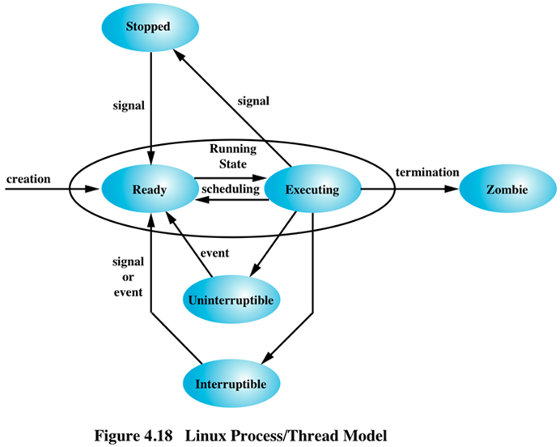
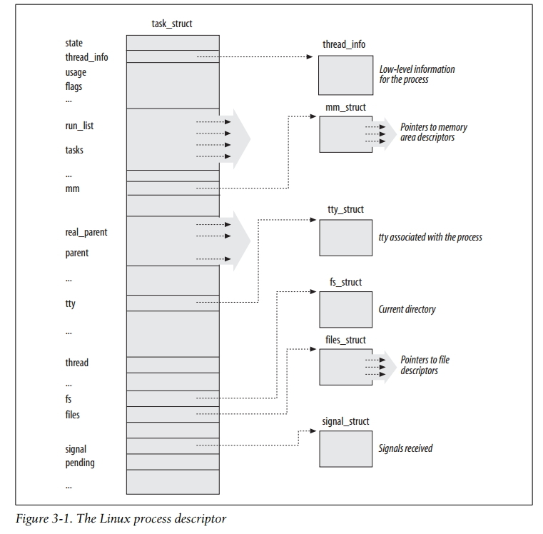

>这篇文章主要讲linux中进程的概念和进程的管理工具

## 进程的概念

### 什么是进程
进程（Process）是计算机中程序执的实体。程序通常是由指令和相关数据组成的，在 Linux 系统中，程序的运行通常是由用户通过一个命令行解释器（例如 bash shell）发起执行，或者由其他进程派生而来。

### 进程标识符
每个进程都有一个非负整数表示的唯一标识符，进程运行时 PID 是由操作系统随机分配的，进程 ID 可以重用。当一个进程终止后，其进程 ID 就可以再次使用了。大多数 UNIX 系统实现延迟重用算法，使得赋予新建进程的 ID 不同于最近终止进程所使用的 ID。

### 一些特殊进程

系统中有一些专用的进程。ID 为 0 的进程通常是调度进程，常常被称为「交换进程」（swapper）。该进程是内核的一部分，它不是磁盘的程序。ID 为 1 的进程是 init 进程，在系统自举过程结束时由内核调用。该进程的程序文件是 /sbin/init 。此进程负责在自举内核后启动一个 Unix 系统。init 通常会读取与系统有关的初始化文件（/etc/rc* 或 /etc/inittab，以及 /etc/init.d/ 中的文件），并将系统启动至某个状态。init 进程不会终止，系统启动后产生的所有进程都由 init 进程衍生而来。

### PPID
每个进程除了一定有 PID 还会有 PPID，也就是父进程 ID，通过 PPID 可以找到父进程的信息。系统启动后所有的进程都由 init 进程衍生而来。

因为所有进程都来自于一个进程，所以 Linux 的进程模型也叫做进程树。

使用 pstree 命令可以查看系统当前的进程树：

```
[root@bogon ~]# pstree
init─┬─abrtd
     ├─acpid
     ├─atd
     ├─auditd───{auditd}
     ├─automount───4*[{automount}]
     ├─console-kit-dae───63*[{console-kit-da}]
     ├─crond
     ├─cupsd
     ├─dbus-daemon
     ├─2*[dhclient]
     ├─hald─┬─hald-runner─┬─hald-addon-acpi
     │      │             └─hald-addon-inpu
     │      └─{hald}
     ├─login───bash
     ├─master─┬─pickup
     │        └─qmgr
     ├─5*[mingetty]
...（省略）
```

### 进程的内存空间
在一个多任务操作系统当中，可能存在着上千个进程，而物理内存只有一个，为了防止进程访问原本不属于本进程的内存空间，现代操作系统都会使用「内存保护」技术。

每一个进程都运行在它自己的内存沙箱（sandbox）中。这个沙箱被称作「虚拟地址空间」（virtual address space），在 32 位的系统中，它是一个 4GB 大小的内存地址空间，虚拟内存是线性可编址的，其使用单位是页（page），对应的物理内存被称为页框（page frame）。这些虚拟的地址通过页表（page table）映射至真实的物理内存，页表由操作系统内核和处理器（内存管理单元）负责管理。每个进程都有它自己的页表。这里需要注意，所有的进程都运行在「虚拟内存」中，即使是内核本身也一样。因此，虚拟地址空间中的一部分是专门供内核使用的。


Linux 系统中虚拟地址空间中的最高地址的 1GB 为内核空间（kernel space），但这并不意味着内核实际使用了这么多物理内存。在页表中，内核空间被标记为特权指令（privileged code，CPU 的 ring 0）专用，因此一个普通进程在访问时会产生页错误（page fault）。对于所有的进程来说，虚拟地址空间中的内核空间都被映射至相同的物理内存地址，而每个进程的用户空间被映射至物理内存地址的情况都不相同。

一个进程可能不会需要同时使用所有的虚拟内存中的代码和数据，Linux 使用了请求分页技术（demand paging），某些数据可能在进程虚拟地址空间中存在，但是并没有被载入到物理内存中，仅当进程试图访问这些数据时，系统硬件将产生一个页错误（page fault），由内核负责将数据载入物理内存（如果数据已经在物理内存中存在则不需要载入），并将虚拟内存地址映射至响应的物理内存地址。

关于进程的内存空间的其他细节，可以参考：
- [Anatomy of a Program in Memory](http://duartes.org/gustavo/blog/post/anatomy-of-a-program-in-memory/)
- [What a C programmer should know about memory](http://marek.vavrusa.com/c/memory/2015/02/20/memory/)
- [Journey to the Stack, Part I](http://duartes.org/gustavo/blog/post/journey-to-the-stack/)

### 进程的状态
系统中可能存在大量进程，而 CPU 的数量是有限的，因此进程并不一定处于运行状态。在 Linux 系统中，进程有下面这些状态：


- Executing: 进程正在 CPU 上运行。
- Ready: 进程处于准备运行状态，它被放置在一个运行队列中，等待系统分配 CPU 资源给它。
- Stopped: 进程被停止，通常是通过接收一个信号，正在被调试的进程可能处于停止状态。
- Uninterruptible: 不可中断睡眠，处于这个状态的进程通常需要等待某个资源，而且在等待过程中进程会忽略任何信号。被磁盘设备 I/O 所阻塞的进程可能处于这个状态。
- Interrruptible: 可中断睡眠状态，进程需要等待某个特定的条件为真，才会继续运行，可中断睡眠状态的进程可以被信号唤醒。
- Zombie: 子进程已经结束，而父进程没有调用 wait() 或者 waitpid() 系统调用获取子进程的终止状态，导致进程的进程描述符没有被回收。

### 进程描述符
为了管理进程，内核需要追踪每个进程的运行状态，例如进程的优先级，PID，进程的地址空间等信息。内核使用一个 task_struct 类型的结构体来保存这些信息，它被称为进程描述符，对于每个进程，内核都为其创建一个进程描述符，内核使用双向链表的结构来存储这些进程描述符。


### 进程的产生方式
进程不是凭空创建的，每个进程都是由其父进程衍生而来，在 Linux 系统中，父进程通常使用 fork() ， vfork() 或 clone() 等系统调用来生成子进程。

### fork 创建的进程成被称为「子进程」（child process）。例如，在 shell 中执行一个命令时，shell 进程就会调用 fork() 产生一个子进程，然后子进程调用 exec() 执行命令程序，进程结束后返回控制至父进程 shell 进程。

#### 写时复制

在 Linux 系统中，进程使用 fork() 产生的子进程时，并没有立即为子进程分配物理页框。Linux 系统使用了写时复制（Copy On Write, COW）技术。这意味着子进程被创建时，与其父进程共享相同的物理页框（page frame），子进程实际使用的是其父进程的堆栈空间，内核将这些共享区域标记为只读。当父、子进程中的任一个试图修改这些区域时，内核会为修改区域的那块内存制作一个副本，并标记为可写，对于原来的共享内存页框，内核会检查是否此页框只被一个进程所使用，如果只被一个进程使用，那么此页框也为可写。这样做的原因是子进程的生命周期可能很短，使用「写时复制」技术可以按需为进程分配内存，使得内存的分配更加高效。

### 僵尸进程（Zombie）

当一个进程完成它的工作终止之后，它的父进程需要调用 wait() 或者waitpid() 系统调用取得子进程的终止状态。

一个进程使用 fork 创建子进程，如果子进程退出，而父进程并没有调用 wait 或 waitpid 获取子进程的状态信息，那么子进程的进程描述符仍然保存在系统中而未被释放。 这种进程称之为僵死进程。

### 孤儿进程（Orphan Process）

如果父进程产生子进程后终止了，且子进程继续运行，子进程被称为孤儿进程，孤儿进程由 init 进程收养，它的 PPID 变为 1。

### 进程调度
在同一个时刻，一个 CPU 核心上只能运行一个进程，CPU 在某一个时刻运行哪个进程需要依靠操作系统内核来进行调度。操作系统为每个进程分配一个优先级，系统内核根据优先级来调度进程运行。

### 进程的优先级

Linux 中共有 0~139 种优先级，其中 1-99 被称为实时优先级，数字越大优先级越高。100-139 被称为动态优先级，内核可以调整进程的动态优先级。还可以使用 nice 或 renice 指令调整进程的动态优先级。


Linux 系统使用了抢占式的进程调度。这意味着，当一个进程进入 TASK_RUNNING 状态（即准备运行状态）时，内核检查次进程的优先级，并与当前正在运行的进程的优先级进行比较，如果次进程的优先级更大，当前运行的进程被中断，又调度器重新挑选一个进程运行。

### 调度策略

Linux 系统对每种优先级都维护一个运行队列和过期队列，系统每次从优先级最高的运行队列中挑选进行运行，然后放入其过期队列中。当运行队列中的进程全部进入过期队列后，再将过期队列和运行队列对调。

### 守护进程
守护进程（Daemon）是一种后台服务进程，它们通常不与终端关联，用户空间守护进程的父进程是 init 进程。Linux 中的很多服务都以守护进程模式运行，它们不会随着终端的退出和登录而改变进程状态。

### 进程的管理与监控
#### htop
Htop 是 Linux 系统中的一个交互式的系统监控和进程查看工具，它被设计用来取代传统的 Unix 系统监控工具 top。Htop 的界面更加直观，功能更加强大，实乃居家旅行杀人越货的必备神器。

在 CentOS/RHEL 系统中，htop 由 epel 提供安装，安装后的启动界面如下：
略

最上方，htop 提供了 CPU，内存和 Swap 的使用状态，并用不同颜色标识出了不同类型的 CPU 或 内存使用情况，各颜色的意义如下：

右上方，htop 提供了系统中运行的所有任务数量，1分钟，5分钟和15分钟的平均负载，系统的启动时长信息。

界面的中间是进程的相关信息，htop 默认按 CPU 使用率对进程进行排序。这里各个字段的意义如下：
```
PID：进程 ID
USER：运行进程的用户身份
PRI：进程的优先级
NI： 进程的 NICE 值，这个值从 -20 ~ 19，数值越小优先级越高
VIRT：进程的虚拟内存使用量
RES：进程的实际物理内存使用量
SHR：进程的内存中使用的共享内存映射的区域大小
S：进程的状态
CPU%：进程的 CPU 使用率
MEM%：进程的内存使用率
TIME+：进程占用 CPU 的累积时长
Command：进程的启动指令
htop 还可以使用交互式的命令

u：过滤仅显式指定用户的进程
s：追踪选定进程的系统调用（类似于 strace 的功能）
l：显式选定进程打开的所有文件（类似与 lsof 的功能）
t：显示进程结构
a：设定进程的 CPU affinity，可以将进程绑定在指定的 CPU 上
```
在最下方 htop 还提供了 F1 ~ F10 十个按键，分别提供了帮助，设置，过滤，搜索，调整进程优先级，kill 进程等功能。

值得一说的是 htop 甚至还支持使用鼠标点击操作。

#### glances
glances 是一款用 Python 开发的系统状态监控工具，它的监控指标也特别的丰富。在 CentOS 系统中由 epel 提供安装。

glances 的界面如下：
略


这里显示了系统的 CPU使用率，平均负载，内存使用情况，Swap 使用情况，网络接口流量速率，磁盘 I/O 速率，挂载分区的空间使用率以及进程状态等信息。

glances 可以使用交互式命令打开和关闭某类监控，改变监控指标单位，改变进程排序列。
```
a：自动对进程排序
c：根据 CPU 使用率对进程排序
m：根据内存使用率对进程排序
i：根据 I/O 速率对进程排序
d：关闭/开启 磁盘 I/O 状态信息
f：关闭/开启 文件系统状态信息
1：全局 CPU 状态 / 单个显示 CPU 状态
u：显示网络接口的累积流量
```
dstat
dstat 是一款功能非常强大的系统性能监控工具，它整合了 vmstat，iostat，netstat 和 ifstat 四款工具的功能。

dstat 常用的选项：
```
-c: 显示cpu性能指标相关的统计数据
-d: 显示disk相关的速率数据
-g: 显示page相关的速率数据
-i: 显示interrupt相关的速率数据
-l: 显示load average相关的统计数据
-m: 显示memory相关的统计数据
-n: 显示网络收发数据的速率
-p: 显示进程相关的统计数据
-r: io请求的速率
-s: 显示swap的相关数据
-y: 显示系统相关的数据，包括中断和进程切换

--top-cpu：显示最占用CPU的进程
--top-bio：显示最消耗block io的进程
--top-io：最占用io的进程
--top-mem：显示最占用内存的进程

--ipc: 显示进程间通信相关的速率数据
--raw: 显示raw套接的相关的数据
--tcp: 显示tcp套接字的相关数据
--udp: 显示udp套接字的相关数据
--unix: 显示unix sock接口相关的统计数据
--socket: 显示所有类型套接字的相关数据

-a: 相当于-cdngy
```
dstat 还可以支持插件工作，它的插件位于 /usr/share/dstat 目录中，可以使用这些插件对 mysql 等程序进行监控。

引用：[坚实的幻想](http://liaoph.com/inux-process-management/)