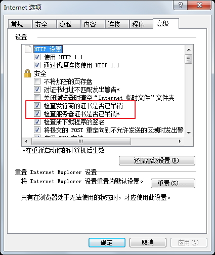

# 安全概要
## 安全的目标
信息加密是为信息安全服务的，信息作为一种有价值的资产，需要保护免受攻击。
为了保证信息的安全，通常需要实现三个安全目标：机密性、完整性、可用性（不可否认性）。

### 机密性
机密生是指保护信息的机密笥，阻止非法访问。
>通常有两种攻击威胁到信息的机密生：嗅探和流量分析。

### 完整性
完整性是指保护信息不被他人非法篡改，接收者应该能心某种方式验证信息的完整性。
>信息的完整性受到多种攻击的威胁：修改、冒充、回放。

### 可用性
可用性指信息对授权用户和应用程序应该是可用的。
>对可用性的攻击最著名就是DDOS。

## 加密算法
>主要解决安全三大目标中的“机密性”
### 对称加密
为了解决算法被破解的问题，密码学上有著名的：即使密码系统的任何细节已为人悉知，只要密钥未泄漏，它也应是安全的。

上图显示了对称密钥加密的基本思想，爱丽丝通过一个不安全的信道向博比发送一则消息，假设一个攻击者伊夫在信道上偷听，但她也不能理解消息的内容。

对称密钥密码对加密和解密使用同一个密钥。此外，加密算法和解密算法互为相反，即使算法是公开的，只有没有密钥，也无法从密文解密出明文。需要保密的唯一东西就是密钥。这意味着爱丽丝和博比需要另外一个（安全的）信道来交换密钥。爱丽丝和博比可能会面对面亲自交换密钥。

在计算机世界，对称加密的密钥交换手段常用的有 [Diffie Hellman](http://zh.wikipedia.org/wiki/%E8%BF%AA%E8%8F%B2%EF%BC%8D%E8%B5%AB%E5%B0%94%E6%9B%BC%E5%AF%86%E9%92%A5%E4%BA%A4%E6%8D%A2)密钥交换算法，或者使用非对称加密来交换密钥。常见的对称加密算法有 DES（密钥太短，容易被破解），AES，3DES，Blowfish，twofish 等。

对称加密的一个问题是，通信者需要对每一个通信维护一个密钥，且通信双方在密钥交换时无法验证对方身份的真实性。

### 非对称加密

上图显示了非对称加密技术的总体思想。在非对称加密中有不同的密钥：私钥（private key）和公钥（public key）。使用公钥加密的数据只能由对应的私钥解密。在这里博比创建了两个密钥：一个私钥和一个公钥。他负责把公钥分发出去，此信道不需要保证安全，但它必须提供身份验证和数据完整性。

非对称加密中，通信中的每个个体应该创建自己的私钥和公钥。上图中爱丽丝使用博比的公钥，发送加密信息给博比。如果博比需要回应，那么爱丽丝就需要建立她自己的私钥和公钥。

非对称加密中，博比只需要一个私钥就能从任何人那里接收加密的信息。但爱丽丝需要 n 个公钥与 n 个人进行通信，一人一个公钥。

最常用的非对称加密算法是 RSA 算法。

由于非对称加密的速度非常慢，因此非对称加密很少用于数据的传输，一般将其用于对称密钥的安全传输，传输密钥后再使用对称加密进行数据通信。

### 数字签名
>主要解决安全三大目标中的“完整性”

非对称加密的另一个用途是用于数字签名，签署者使用他的私钥（应用一个签名算法）来签署文档。验证者使用签署者的公钥（公开的）验证文档。当一个文档被签署时，任何人都能验证它，因为任何人都能访问签署者的公钥。由于私钥的保密性，签名是无法伪造的。


### 单向散列算法

单向散列算法也称 Hash（哈希）算法，是一种将任意长度的消息压缩到某一固定长度（消息摘要）的函数，该过程是不可逆的，即不可能通过散列加密后的的结果逆向得出原始的信息。

Hash 函数有下面的特性：

1. 输入一样，输出必然相同
2. 输入的微小改变，会造成结果的巨大变化
3. 无法根据特征码还原原来的数据
4. 定场输出

常见的散列加密算法有 MD1，MD5，SHA1，SHA512，CRC-32 等。

单向加密通常用于验证数据的完整性，在数据发送之前，对数据进行单向加密得出特征码，然后接受者再次对接收的数据使用同样的单向加密，如果得到的特征码相同，则说明数据是完整的。

但是单纯的使用单向加密，无法保证数据被篡改，因此还需要借助其他加密算法（如数字签名）。


## SSL/TLS加密技术应用

加密技术被广泛用于 HTTP 互联网通信中，由于原始的 HTTP 协议并没有任何加密的功能，为了保证某些敏感数据的数据安全，在 HTTP 协议之上引入了 SSL/TLS 层，称为 HTTPs，用于数据的加密传输。

客户端和主机进行 HTTP 通信之前，先建立 SSL/TLS 连接，加密通信的数据。

1. 服务端和客户端建立连接，进行加密算法协商
2. 服务端预先生成一对密钥，并向客户端发送其公钥
3. 客户端生成一个对称密钥，并使用服务端的公钥加密这个密钥，发送至服务端
4. 服务端使用自己的私钥解密出对称密钥，然后双方的 SSL 连接建立成功
5. 之后的通信数据都使用对称加密的方式进行加密。

## CA

在 SSL/TLS 连接建立之前，客户端和服务端可能是没有通信过的，那么服务端发送的公钥的合法性就无法保证，因此引入了一个第三方机构 CA（Certificate Authority），服务端发送的公钥前，必须向 CA 发出申请，由 CA 对服务器的公钥等信息进行数字签名，生成证书。客户端使用 CA 的公钥可以对服务端的证书进行验证，且 CA 的公钥证书通常是内置在操作系统和浏览器中的。

常用的证书格式是 x509 格式，它包含有下面的信息：

- 版本号（version）
- 序列号（serial number），CA 用于唯一标志此证书
- 签名算法标志（signatur algotithm ientifier）
- 发行者的名称，即 CA 自己的名称
- 有效期，起始日期和终止日期
- 整数主题明还曾，整数拥有者自己的公钥
- 发行商的唯一标识
- 整数主题的唯一标志
- 扩展信息
- 签名：CA 对此证书的数字签名

可以在浏览器中查看使用了 HTTPs 协议的网站的证书的信息：


### CRL

如果 CA 颁发给了某客户一个证书而此客户进行了违规操作，或客户的私钥被窃取了，那么 CA 需要吊销此颁发出去的证书。CRL 指的就是证书吊销列表。因此客户端在接收到服务端证书后，需要先去获取最新的 CRL 文件，查看服务器的证书是否已经被吊销，如果已被吊销则此证书不能信任。

下图是浏览器中对证书吊销的验证设置：



由于 CRL 文件需要下载，另一个替代的方案是 OSCP(Online Certificate Status Protocol)，可以直接使用此协议请求查看某证书是否已被吊销。

### PKI
PKI 的全称是 Public Key Infrastructure，它包含了用于申请整数的 RA（Registratoin Authority），用于颁发证书的 CA，以及验证证书合法性的 VA（Validation Authority）等等。通过这系列的机构和组织来管理，使用，分发和存取数字证书，保证信息的安全。


### OpenSSL
OpenSSL 是一个开源组织，它发布了可以运行于 Linux/Unix 上的，用于 SSL/TLS和各种加密算法的开源实现的软件。

openssl 主要包含三个组件：
1. libcrypto：通用加密库
2. libssl：TLS/SSL 的实现
3. openssl 命令行工具

openssl 是一个强大的命令行工具，它可以实现对称加密/解密，非对称密钥的生成，单向加密提取特征码，对密码单向加密，生成随机数等等功能。

#### 进行对称加密

例如，对 /etc/issue 使用 3des 加密，存放于 /tmp 目录中

`# openssl enc -e -des3 -a -salt -in /etc/issue -out /tmp/issue`

输入密码后，即可对文件加密。解密方法：
`# openssl enc -d -des3 -a -salt -in /tmp/issue -out /tmp/issue.new`

#### 提取特征码
提取特征码使用 dgst 子命令：
`# openssl dgst -md5|-sha1 /PATH/TO/FILE`
-md5 和 -sha1 表示单向加密算法。

#### 生成随机数
`# openssl rand -base64|-hex ###`

-base64 和 -hex 可以将随机数转换为字符格式显示。

#### 生成非对称密钥

生成 RSA 私钥对：

`# (umask 077; openssl genrsa -out /PATH/TO/KEYFILE NUMBITS)`

这里可以指定密钥文件路径和密钥位数，位数通常为 1024，2048，4096 位。

从私钥中提取公钥：

`# openssl rsa -in /PATH/TO/KEYFILE -pubout`

### openssl 实现私有 CA

私有 CA 先要生产 CA 自己的证书，CA 证书的路径在 /etc/pki/tls/openssl.conf 中配置， 在 [ CA_default ] 选项下
```
dir            =  /etc/pki/CA
							#工作目录
certs          =  $dir/certs
							#客户端证书保存目录
crl_dir        =  $dir/crl
							#证书吊销列表的位置
database       =  $dir/index.txt
						 	#证书发证记录数据库
new_certs_dir  =  $dir/newcerts
							#新生成证书存放目录
certificate    =  $dir/cacert.pem
							#CA的证书文件
serial         =  $dir/serial
							#签发证书的序列号，一般从01开始
crlnumber      =  $dir/crlnumber
							#帧数吊销列表的序列号
crl            =  $dir/crl.pem
							#证书吊销列表文件
private_key    =  $dir/private/cakey.pem
							#CA的私钥文件
RANDFILE       =  $dir/private/.rand
						 	#随机数生产文件，会自动创建
default_days   = 365
							#默认签发有效期
```

#### 建立私有 CA

1.创建 CA 的私钥

`# (umask 077; openssl genrsa -out /etc/pki/CA/private/cakey.pem 2048)`

2.生成自签署证书

`# openssl req -new -x509 -key /etc/pki/CA/private/cakey.pem -out /etc/pki/CA/cacert.pem`
这里指定了证书的格式为 x509 格式，因此需要填入 CA 机构自己的相关信息。以后此 CA 签署证书时，证书的信息必须和 CA 证书中的信息相对应。

3.创建需要的目录，序列号和数据库文件
```
# mkdir -pv /etc/pki/CA/{certs,newcerts,crl}
# touch /etc/pki/CA/{index.txt,serial}
# echo 01 > /etc/pki/CA/serial
```

#### 生成一个 httpd 的证书并由私有 CA 签署

1.创建 httpd 使用的私钥

`# (umask 077; openssl genrsa -out httpd.key 1024 )``
2.创建整数请求文件

`# openssl req -new -key httpd.key -out httpd.csr`
3.将证书签名请求文件发送给 CA 签署（这里 CA 其实就是本机）

`# openssl ca -in httpd.csr -out httpd.crt -days 365`

对于RHEL系列的系统，系统会提供一个 Makefile 文件，可以使用 make命令快速的生成测试使用的私钥，证书，证书申请文件

Makefile 文件位置： /etc/pki/tls/certs/Makefile，文件会根据后缀名自动判断生成什么类型的文件，进入/etc/pki/tls/certs/Makefile 目录，执行 make FILE.EXT 即可。

查看帮助

`# make usage`

创建一个私钥

`# make test.key`

这里默认是要密码的，因为其使用了 openssl genrsa -aes128 2048 这样的语句，可以打开 Makefile 文件将 -aes128 选项删除，生成私钥时就不需要密码了。

生成证书请求文件

`# make test.csr`

生成自签署证书

`# make test.crt`

创建一个包含私钥的自签证书

`# make test.pem`