# 安全概要
## 安全的目标
>安全需求起始于军事

信息加密是为信息安全服务的，信息作为一种有价值的资产，需要保护免受攻击。
为了保证信息的安全，通常需要实现三个安全目标：机密性、完整性、可用性（不可否认性）。

### 机密性 confidentiality
机密生是指保护信息的机密笥，阻止非法访问。
>通常有两种攻击威胁到信息的机密生：嗅探snooping和流量分析traffic analysis。

### 完整性 integrity
完整性是指保护信息不被他人非法篡改，接收者应该能心某种方式验证信息的完整性。
>信息的完整性受到多种攻击的威胁：修改、冒充、回放。

### 可用性/有效性 availability
可用性指信息对授权用户和应用程序应该是可用的。
>对可用性的攻击最著名就是DDOS。

### 安全攻击
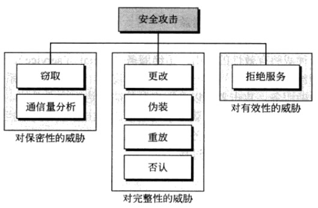

## 解决方案

- 技术（加密和解密）
  - 传统加密方法：替代加密方法、置换加密方法
  - 现代加密方法：现代块加密方法
    - 现代块加密： 把发送的整个数据切割固定成块，每块单独加密，前后两个块建立关联关系；
- 服务（用于抵挡攻击的服务，也既是为上述安全目标而特定设计的安全服务）
  - 认证机制
  - 访问控制机制


## 加密算法和协议

>实现上述加密和解密、服务方案。
- 对称加密
- 公钥加密
- 单向加密
- 认证协议

Linux系统上述功能解决方案：

- OpenSSL：SSL协议和加密库的实现
- GPG(PGP)：GPG协议的实现
  - GPG是基于gpg协议实现的非对称加密工具
  - 命令行工具： gpg
  - 其他参考：
    - GnuPG HOWTO_zh <http://www.gnupg.org/howtos/zh/>
    - GPG加解密中文教程 <http://www.alexgao.com/2009/01/24/gpg/>


### 对称加密
> 加密和解密使用同一个密钥

为了解决算法被破解的问题，密码学上有著名的[柯克霍夫原则](http://www.wikiwand.com/zh/%E6%9F%AF%E5%85%8B%E9%9C%8D%E5%A4%AB%E5%8E%9F%E5%89%87)：即使密码系统的任何细节已为人悉知，只要密钥未泄漏，它也应是安全的。
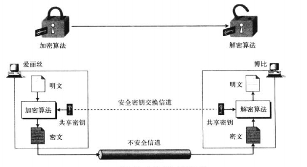
上图显示了对称密钥加密的基本思想，爱丽丝通过一个不安全的信道向博比发送一则消息，假设一个攻击者伊夫在信道上偷听，但她也不能理解消息的内容。

对称密钥密码对加密和解密使用同一个密钥。此外，加密算法和解密算法互为相反，即使算法是公开的，只有没有密钥，也无法从密文解密出明文。需要保密的唯一东西就是密钥。这意味着爱丽丝和博比需要另外一个（安全的）信道来交换密钥。爱丽丝和博比可能会面对面亲自交换密钥。

在计算机世界，对称加密的密钥交换手段常用的有 [Diffie Hellman](http://zh.wikipedia.org/wiki/%E8%BF%AA%E8%8F%B2%EF%BC%8D%E8%B5%AB%E5%B0%94%E6%9B%BC%E5%AF%86%E9%92%A5%E4%BA%A4%E6%8D%A2)密钥交换算法，或者使用非对称加密来交换密钥。常见的对称加密算法有 DES（密钥太短，容易被破解），3DES，AES，Blowfish，twofish 等。

#### 对称加密算法介绍

说明：加密数据依赖与算法和密钥，安全性依赖于密钥。因为算法是公开的人人都可以得到，但是密钥只有通信的主机才有；
```
DES：Data Encryption Standard
    IBM实验室研发；加密端64位明文产生64为密文，解密端64位密文还原64位明文，8个字节为一块，加密和解密使用56位密钥，DES使用16个迭代块实现，是现代加密算法；

3DES: Triple DES
    DES的增强版，比DES多3个数量级

AES: Advanced Data Encryption Standard; (128bits, 192bits, 256bits, 384bits)
    3DES虽然现在是安全的，但随着计算机硬件的更新，总有一天要被攻破；AES算法欲取待3DES算法，他支持128，192和256位密钥长度，有效的密钥长度可达上千位。
    更重要的是，AES算法采用了更为高效的编写方法，对CPU的占用率较少；目前广泛使用。

商业：Blowfish，twofish，IDEA，RC6，CAST5等等...

特性：
    1、加密、解密使用同一个密钥
    2、将原始数据分割成为固定大小的块，逐个进行加密；
    3、加解密速度快（相对于公钥算法）

缺陷：
    1、密钥过多：作为服务器端需要与成千上万个人通信，每一个人都有密钥，
    2、密钥分发困难：密钥交换困难
```

对称加密的一个问题是，通信者需要对每一个通信维护一个密钥，且通信双方在密钥交换时无法验证对方身份的真实性。

### 非对称加密

>密钥分公钥和与之配对的私钥

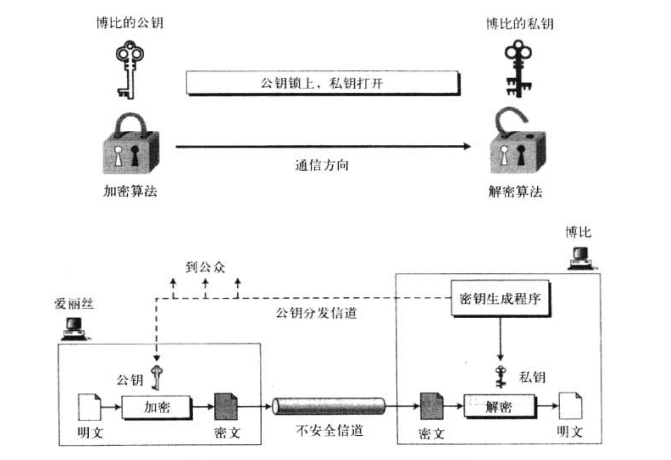
上图显示了非对称加密技术的总体思想。**在非对称加密中有不同的密钥：私钥（private key）和公钥（public key）。使用公钥加密的数据只能由对应的私钥解密。**在这里博比创建了两个密钥：一个私钥和一个公钥。他负责把公钥分发出去，此信道不需要保证安全，但它必须提供身份验证和数据完整性。

非对称加密中，通信中的每个个体应该创建自己的私钥和公钥。上图中爱丽丝使用博比的公钥，发送加密信息给博比。如果博比需要回应，那么爱丽丝就需要建立她自己的私钥和公钥。

非对称加密中，博比只需要一个私钥就能从任何人那里接收加密的信息。但爱丽丝需要 n 个公钥与 n 个人进行通信，一人一个公钥。

最常用的非对称加密算法是 RSA 算法。

由于非对称加密的速度非常慢，因此非对称加密很少用于数据的传输，一般将其用于对称密钥的安全传输，传输密钥后再使用对称加密进行数据通信。

#### 公钥算法介绍

```
公钥：从私钥中提取产生；公共给所有人;pubkey
私钥：通过工具创建，使用者自己留存，必须保证其私密性；secret key;
特点：公钥和私钥都能对数据加密和解密；用公钥加密的数据，只能使用与之配对的私钥解密；反之亦然；

用途：
    数组签名：主要在于让接收方确认发送方的身份，完成身份认证；
    密钥交换：发送方用对方的公钥加密一个对称密钥，并发送给对方；
    数据加密：很少使用，一般都是用来加密对称加密的密钥

用公钥加密的数据，只有私钥能解密，其保密性能到了保障；性能较差
用私钥加密的数据，只能用公钥解密，任何人都何以获得公钥，可以确认发送方身份(身份认证)；

算法：
	RSA,DSA,ELGamal
    DSS: Digital Signature Standard
    DSA: Digital Signature Algorithm


    RSA：能实现签名，加密和解密，
    DSA：只能加密，只能做数字签名（身份认证）
    ELGamal：商业算法

    就算法本身的实现来讲，公钥加密技术比对称加密技术的速度慢上差不多3个数量级，一个数量级就是10倍，所以3个数量级不是30倍，而是1000倍。因此，在加密数据时是很少用到公钥去加密的。
```


### 数字签名
>主要解决安全三大目标中的“完整性”

非对称加密的另一个用途是用于数字签名，签署者使用他的私钥（应用一个签名算法）来签署文档。验证者使用签署者的公钥（公开的）验证文档。当一个文档被签署时，任何人都能验证它，因为任何人都能访问签署者的公钥。由于私钥的保密性，签名是无法伪造的。

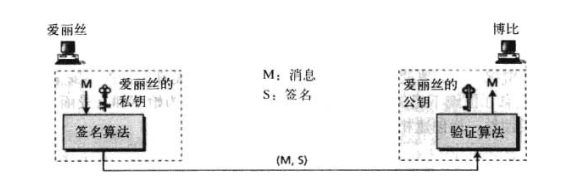


### 单向散列算法

单向散列算法也称 Hash（哈希）算法，是一种将任意长度的消息压缩到某一固定长度（消息摘要）的函数，该过程是不可逆的，即不可能通过散列加密后的的结果逆向得出原始的信息。

#### 单向加密介绍

```
单向散列算法也称HASH算法。
特性：
    定长输出：无论原来的数据是多大级别，其加密结果长度一样；
    雪崩效应：原始数据修小改变，将会导致结果巨大变化；
    不可逆：不能通过特征码还原数据（就比如拿到一个人的指纹无法，还原一个人）
    输入一样，输出必然相同

功能：验证数据完整性；
	在数据发送之前，对数据进行单向加密得出特征码，然后接受者再次对接收的数据使用同样的单向加密，如果得到的特征码相同，则说明数据是完整的。
	
算法：
    1、md5：message digest,128bits
    2、sha1：secure hash algorithm,160bits
    3、sha224：secure hash algorithm,256bits
    4、sha256：secure hash algorithm,256bits
    5、sha384：secure hash algorithm,384bits
    6、sha512：secure hash algorithm,512bits

用途：
	保证数据完整性：如在一个网站下载软件，为了验证软件在下载过程中没有被第三方修改，网站会提供一个MD5和软件的特征码，只要把MD5码下载下来和我们下载的软件进行运算就可以得到软件的特征码， 只要这个特征码和网站提供的一样，说明软件没有被修改，如果不一样，百分之百是被修改了。
	
	但是单纯的使用单向加密，无法保证数据被篡改，因此还需要借助其他加密算法（如数字签名）。
```

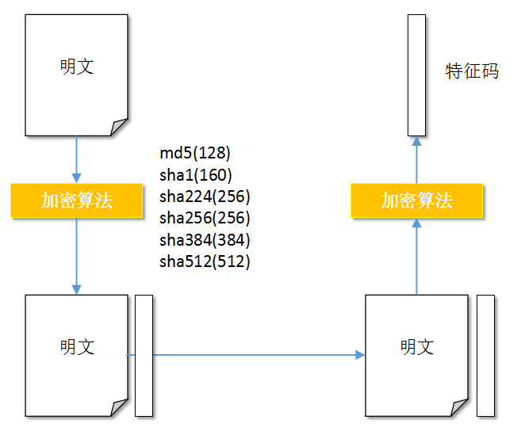

## 密钥交换

密钥交换 IKE  internet Key Exchange

```
密钥交换技术常见的2种：
1、公钥加密：通过非对称加密算法，加密对称加密算法的密钥，在用对称加密算法实际要传输的数据
	非对称加密{对称密钥}，对称密钥加密{通信数据}
2、DH(Deffie-Hellman)
    前提发送方和接受方协商使用同一个大素数P和生成数g，各自产生的随机数X和Y。
    发送方将g的X次方mod P产生的数值发送给接收方，接受方将g的Y次方mod P产生的数值发送给发送方，发送方再对接收的结果做X次方运算，接受方对接收的结果做Y次方运算，最终密码形成，密钥交换完成
    A：p, g
    B：p, g
    
    A: x
        --> p^x%g ==> B
        
        A: (p^y%g)^x=p^yx%g
        
    B: y
        --> p^y%g ==> A
        
        B: (p^x%g)^y=p^xy%g

两种技术更倾向于后者，因为使用公钥发给对方，不管怎么讲这个密码是在网上传输了的，所以其他人有可能通过暴力方式破解；DH的优势在于能让双方使一个眼色而不用发密码，双方就能得到密码了；
```


## 加密技术应用

由于原始的 HTTP 协议并没有任何加密功能的支持，为了保证其上传输的某些敏感数据的数据安全。在 HTTP 协议之上引入了加密技术（主要是SSL/TLS加密协议支持）称为 HTTPs，用于数据的加密传输。

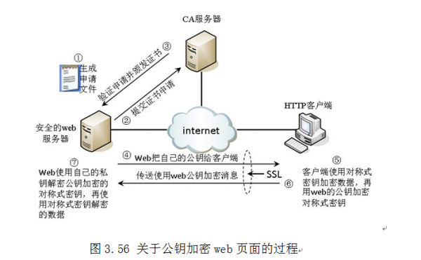


### SSL握手协议简介

```
1. 用户浏览器将其SSL版本号、加密设置参数、与session有关的数据以及其它一些必要信息发送到服务器。
2. 服务器将其SSL版本号、加密设置参数、与session有关的数据以及其它一些必要信息发送给浏览器，同时发给浏览器的还有服务器的证书。如果配置服务器的SSL需要验证用户身份，还要发出请求要求浏览器提供用户证书。
3. 客户端检查服务器证书，如果检查失败，提示不能建立SSL连接。如果成功，那么继续。
4. 客户端浏览器为本次会话生成pre-master secret，并将其用服务器公钥加密后发送给服务器。
5. 如果服务器要求鉴别客户身份，客户端还要再对另外一些数据签名后并将其与客户端证书一起发送给服务器。
6. 如果服务器要求鉴别客户身份，则检查签署客户证书的CA是否可信。如果不在信任列表中，结束本次会话。如果检查通过，服务器用自己的私钥解密收到的pre-master secret，并用它通过某些算法生成本次会话的master secret。
7. 客户端与服务器均使用此master secret生成本次会话的会话密钥(对称密钥)。在双方SSL握手结束后传递任何消息均使用此会话密钥。这样做的主要原因是对称加密比非对称加密的运算量低一个数量级以上，能够显著提高双方会话时的运算速度。
8. 客户端通知服务器此后发送的消息都使用这个会话密钥进行加密。并通知服务器客户端已经完成本次SSL握手。
9. 服务器通知客户端此后发送的消息都使用这个会话密钥进行加密。并通知客户端服务器已经完成本次SSL握手。
10. 本次握手过程结束，会话已经建立。双方使用同一个会话密钥分别对发送以及接受的信息进行加、解密。
```

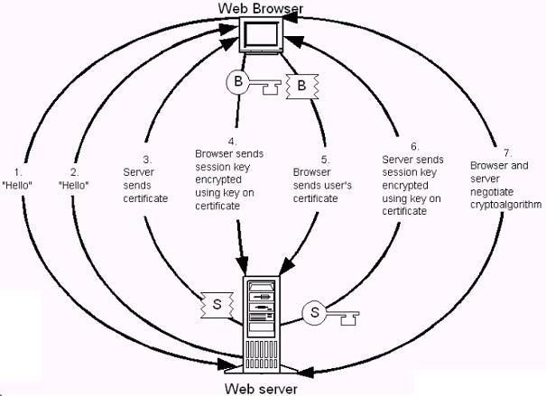


### SSL会话流程

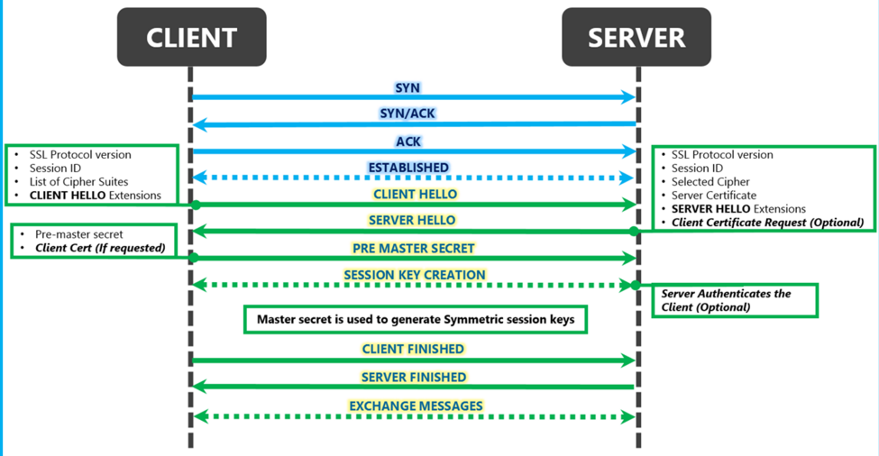


### SSL/TLS加密技术应用

客户端和主机进行 HTTP 通信之前，先建立 SSL/TLS 连接，加密通信的数据。

1. 服务端和客户端建立连接，进行加密算法协商
2. 服务端预先生成一对密钥，并向客户端发送其公钥
3. 客户端生成一个对称密钥，并使用服务端的公钥加密这个密钥，发送至服务端
4. 服务端使用自己的私钥解密出对称密钥，然后双方的 SSL 连接建立成功
5. 之后的通信数据都使用对称加密的方式进行加密。

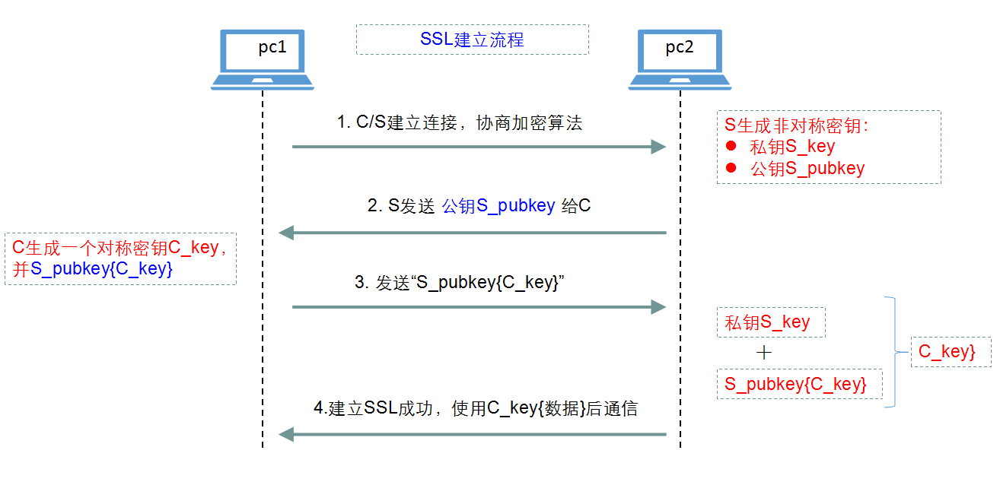

### SSL通信流程问题
- 上图中第2步中的 远端公钥如何确认合法性？（可能的中间人攻击，生活中的例子有冒充警察）


## CA

在 SSL/TLS 连接建立之前，客户端和服务端可能是没有通信过的，那么服务端发送的公钥的合法性就无法保证，因此引入了一个第三方机构 CA（Certificate Authority），服务端发送的公钥前，必须向 CA 发出申请，由 CA 对服务器的公钥等信息进行数字签名，生成证书。客户端使用 CA 的公钥可以对服务端的证书进行验证，且 CA 的公钥证书通常是内置在操作系统和浏览器中的。

常用的证书格式是 x509 格式，它包含有下面的信息：

- 版本号（version）
- 序列号（serial number），CA 用于唯一标志此证书
- 签名算法标志（signatur algotithm ientifier）
- 发行者的名称，即 CA 自己的名称
- 有效期，起始日期和终止日期
- 证书主题明还曾，证书拥有者自己的公钥
- 发行商的唯一标识
- 证书主题的唯一标志
- 扩展信息
- 签名：CA 对此证书的数字签名

可以在浏览器中查看使用了 HTTPs 协议的网站的证书的信息：

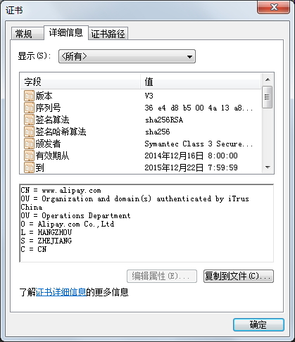

### CRL

如果 CA 颁发给了某客户一个证书而此客户进行了违规操作，或客户的私钥被窃取了，那么 CA 需要吊销此颁发出去的证书。CRL 指的就是证书吊销列表。因此客户端在接收到服务端证书后，需要先去获取最新的 CRL 文件，查看服务器的证书是否已经被吊销，如果已被吊销则此证书不能信任。

下图是浏览器中对证书吊销的验证设置：

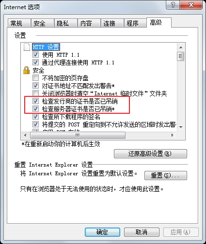

由于 CRL 文件需要下载，另一个替代的方案是 OSCP(Online Certificate Status Protocol)，可以直接使用此协议请求查看某证书是否已被吊销。

### PKI

PKI   Public Key Infrastructure 公钥基础设施是提供**公钥加密和数字签名服务**的系统平台，**目的是为了管理密钥和证书。**

是一种遵循既定标准的密钥管理平台,它能够为所有网络应用提供加密和数字签名等密码服务及所必需的密钥和证书管理体系，简单来说，PKI就是利用公钥理论和技术建立的提供安全服务的基础设施。PKI技术是信息安全技术的核心，也是电子商务的关键和基础技术。

**公开密钥基础建设，又称公开密钥基础架构、公钥基础建设、公钥基础设施或公钥基础架构，是一组由硬件、软件、参与者、管理政策与流程组成的基础架构，其目的在于创造、管理、分配、使用、存储以及撤销数字证书。**

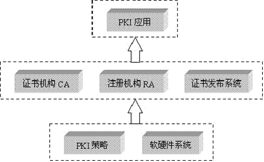


```
CA的核心功能就是发放和管理数字证书。概括地说，CA认证中心的功能主要有：证书发放、证书更新、证书撤销和证书验证。

它包含了:
  RA Registratoin Authority ：负责接受数字证书的请求并认证发出请求的实体
  CA Certification ：发放和管理数字证书
  VA Validation Authority：验证证书合法性的

通过这些系列的机构和组织来管理/使用/分发和存取数字证书，保证信息的安全。

具体描述如下：
（1）接收验证用户数字证书的申请。
（2）确定是否接受用户数字证书的申请，即证书的审批。
（3）向申请者颁发（或拒绝颁发）数字证书。
（4）接收、处理用户的数字证书更新请求。
（5）接收用户数字证书的查询、撤销。
（6）产生和发布证书的有效期。
（7）数字证书的归档。
（8）密钥归档。
（9）历史数据归档。
```

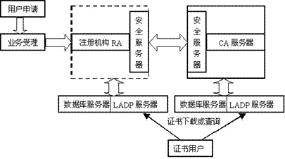


### OpenSSL
OpenSSL 是一个开源组织，它发布了可以运行于 Linux/Unix 上的，用于 SSL/TLS和各种加密算法的开源实现的软件。

openssl 主要包含三个组件：
1. libcrypto：通用加密库
2. libssl：TLS/SSL 的实现
3. openssl 命令行工具

openssl 是一个强大的命令行工具，它可以实现对称加密/解密，非对称密钥的生成，单向加密提取特征码，对密码单向加密，生成随机数等等功能。

#### 进行对称加密

例如，对 /etc/issue 使用 3des 加密，存放于 /tmp 目录中

`# openssl enc -e -des3 -a -salt -in /etc/issue -out /tmp/issue`

输入密码后，即可对文件加密。解密方法：
`# openssl enc -d -des3 -a -salt -in /tmp/issue -out /tmp/issue.new`

#### 提取特征码
提取特征码使用 dgst 子命令：
`# openssl dgst -md5|-sha1 /PATH/TO/FILE`
-md5 和 -sha1 表示单向加密算法。

#### 生成随机数
`# openssl rand -base64|-hex ###`

-base64 和 -hex 可以将随机数转换为字符格式显示。

#### 生成非对称密钥

生成 RSA 私钥对：

`# (umask 077; openssl genrsa -out /PATH/TO/KEYFILE NUMBITS)`

这里可以指定密钥文件路径和密钥位数，位数通常为 1024，2048，4096 位。

从私钥中提取公钥：

`# openssl rsa -in /PATH/TO/KEYFILE -pubout`

### openssl 实现私有 CA

私有 CA 先要生产 CA 自己的证书，CA 证书的路径在 /etc/pki/tls/openssl.conf 中配置， 在 [ CA_default ] 选项下
```
dir            =  /etc/pki/CA   #工作目录
certs          =  $dir/certs    #客户端证书保存目录
crl_dir        =  $dir/crl      #证书吊销列表的位置
database       =  $dir/index.txt  	#证书发证记录数据库
new_certs_dir  =  $dir/newcerts 	#新生成证书存放目录
certificate    =  $dir/cacert.pem 	#CA的证书文件
serial         =  $dir/serial 		#签发证书的序列号，一般从01开始
crlnumber      =  $dir/crlnumber 	#帧数吊销列表的序列号
crl            =  $dir/crl.pem      #证书吊销列表文件
private_key    =  $dir/private/cakey.pem   #CA的私钥文件
RANDFILE       =  $dir/private/.rand       #随机数生产文件，会自动创建
default_days   = 365                #默认签发有效期
```

#### 建立私有 CA

1.创建 CA 的私钥

`# (umask 077; openssl genrsa -out /etc/pki/CA/private/cakey.pem 2048)`

2.生成自签署证书

`# openssl req -new -x509 -key /etc/pki/CA/private/cakey.pem -out /etc/pki/CA/cacert.pem`
这里指定了证书的格式为 x509 格式，因此需要填入 CA 机构自己的相关信息。以后此 CA 签署证书时，证书的信息必须和 CA 证书中的信息相对应。

3.创建需要的目录，序列号和数据库文件
```
# mkdir -pv /etc/pki/CA/{certs,newcerts,crl}
# touch /etc/pki/CA/{index.txt,serial}
# echo 01 > /etc/pki/CA/serial
```

#### 生成一个 httpd 的证书并由私有 CA 签署

1.创建 httpd 使用的私钥

`# (umask 077; openssl genrsa -out httpd.key 1024 )``
2.创建证书请求文件

`# openssl req -new -key httpd.key -out httpd.csr`
3.将证书签名请求文件发送给 CA 签署（这里 CA 其实就是本机）

`# openssl ca -in httpd.csr -out httpd.crt -days 365`

对于RHEL系列的系统，系统会提供一个 Makefile 文件，可以使用 make命令快速的生成测试使用的私钥，证书，证书申请文件

Makefile 文件位置： /etc/pki/tls/certs/Makefile，文件会根据后缀名自动判断生成什么类型的文件，进入/etc/pki/tls/certs/Makefile 目录，执行 make FILE.EXT 即可。

查看帮助

`# make usage`

创建一个私钥

`# make test.key`

这里默认是要密码的，因为其使用了 openssl genrsa -aes128 2048 这样的语句，可以打开 Makefile 文件将 -aes128 选项删除，生成私钥时就不需要密码了。

生成证书请求文件

`# make test.csr`

生成自签署证书

`# make test.crt`

创建一个包含私钥的自签证书

`# make test.pem`


引用文章：<http://liaoph.com/encrytion-and-openssl/>